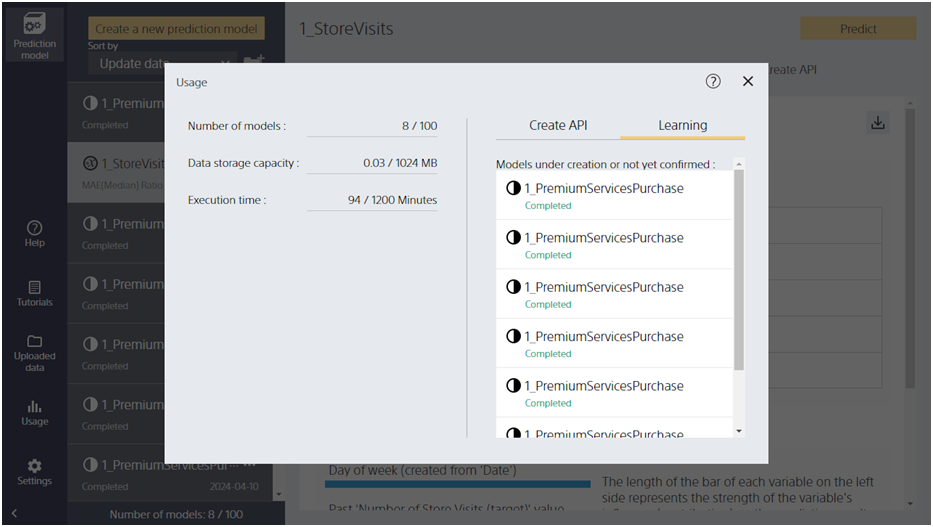
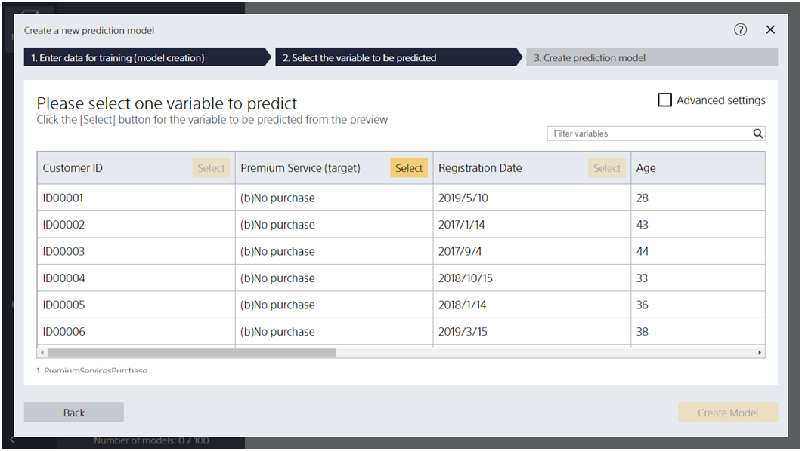

This section describes the operations on each screen of Prediction One.

<h3>Settings/Manual</h3>
<table class="select-screen">
    <tr>
        <td>
          <a href="manual/index.html">
            
            
Document Screen

          </a>
        </td>
        <td>
          <a href="setting/setting/index.html">
            
            
Settings Screen (Desktop version)

          </a>
        </td>
        <td>
          <a href="setting/setting_cloud/index.html">
            
            
Settings Screen (Cloud version)

          </a>
        </td>
        <td>
          <a href="usage/index.html">
            
            
Usage Screen

          </a>
        </td>
    </tr>
    <tr>
      <td>
        <a href="portal/index.html">
          
          
User Portal

        </a>
      </td>
      <td>
        <a href="setting/licence/index.html">
          
          
License Registration

        </a>
      </td>
        <td>
          <a href="help/index.html">
            
            
In-app Help

          </a>
        </td>
      <td>
      </td>
    </tr>
</table>

<h3>Data Preparation</h3>

<table class="select-screen">
    <tr>
        <td>
          <a href="data_preparation/custom/index.html">
            
            
Data Preparation Feature

          </a>
        </td>
        <td>
          <a href="data_preparation/data_list/index.html">
            
            
Data List Screen

          </a>
        </td>
        <td>
        </td>
        <td>
        </td>
    </tr>
</table>

<h3>Prediction Model</h3>
<table class="select-screen">
    <tr>
        <td>
          <a href="datafile/index.html">
            
            
Data List Screen

          </a>
        </td>
        <td>
          <a href="create_model/create_new_model/index.html">
            
            
Data input screen for learning (creating prediction model)

          </a>
        </td>
        <td>
          <a href="create_model/select_target/index.html">
            
            
Model Settings Screen (Simple)

          </a>
        </td>
        <td>
          <a href="create_model/select_target_detail/index.html">
            
            
Model Settings Screen (Details)

          </a>
        </td>
    </tr>
    <tr>
        <td>
          <a href="result/mainresult/index.html">
            
            
Evaluation Result Screen

          </a>
        </td>
        <td>
          <a href="result/advice/index.html">
            
            
Accuracy-Improvement Hint Screen

          </a>
        </td>
        <td>
          <a href="prediction/prediction_input/index.html">
            
            
Prediction Data Input Screen

          </a>
        </td>
        <td>
          <a href="prediction/prediction_preview/index.html">
            
            
Prediction Data Preview Screen

          </a>
        </td>
    </tr>
</table>

<h3>Cloud Version Features</h3>
<table class="select-screen">
    <tr>
        <td>
          <a href="setting/setting/index.html">
            
            
Settings Screen

          </a>
        </td>
        <td>
          <a href="usage/index.html">
            
            
Usage Screen

          </a>
        </td>
        <td>
          <a href="portal/index.html">
            
            
User Portal

          </a>
        </td>
        <td>
          <a href="setting/licence/index.html">
            
            
License Registration Screen

          </a>
        </td>
    </tr>
</table>
