Prediction Oneの各画面での操作について説明します。

<h3>設定・マニュアル</h3>
<table class="select-screen">
    <tr>
        <td>
          <a href="manual/index.html">
            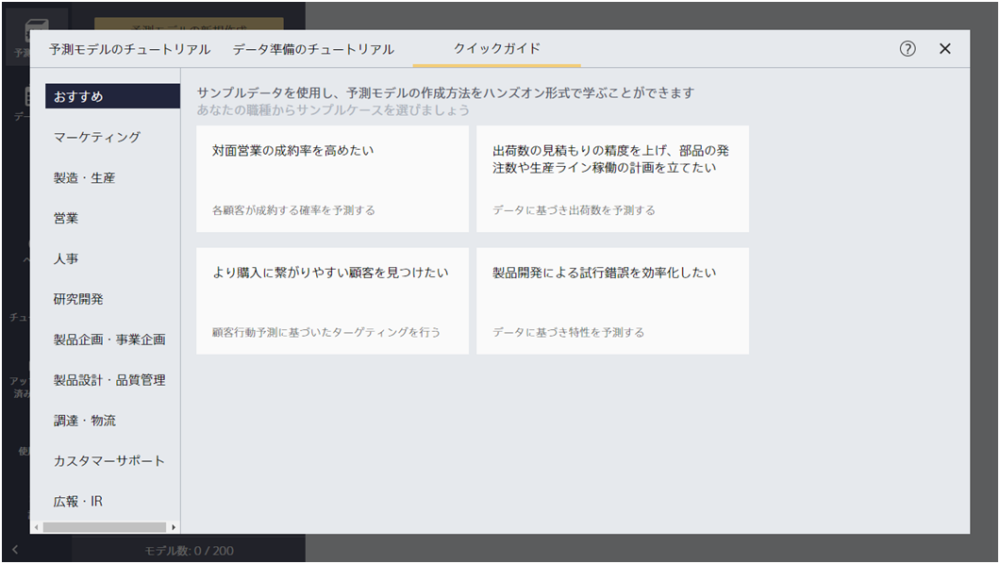
            
チュートリアル画面

          </a>
        </td>
        <td>
          <a href="setting/setting/index.html">
            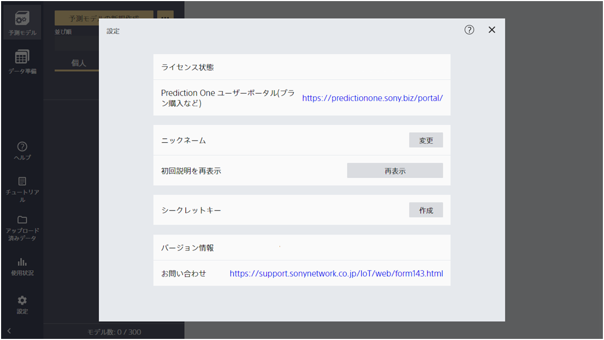
            
設定画面(デスクトップ版)

          </a>
        </td>
        <td>
          <a href="setting/setting_cloud/index.html">
            
            
設定画面(クラウド版)

          </a>
        </td>
        
        <td>
          <a href="usage/index.html">
            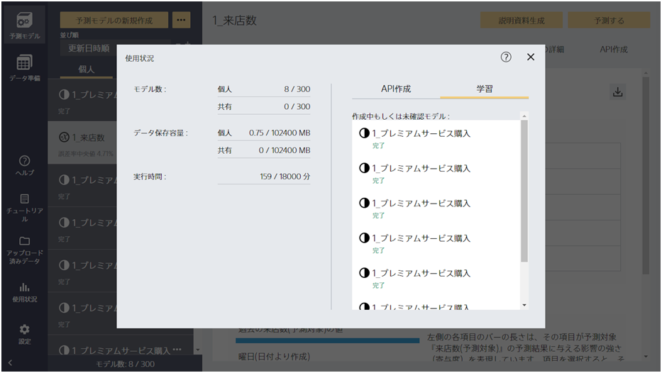
            
使用状況画面

          </a>
        </td>
        
    </tr>
    <tr>
      
      <td>
        <a href="portal/index.html">
          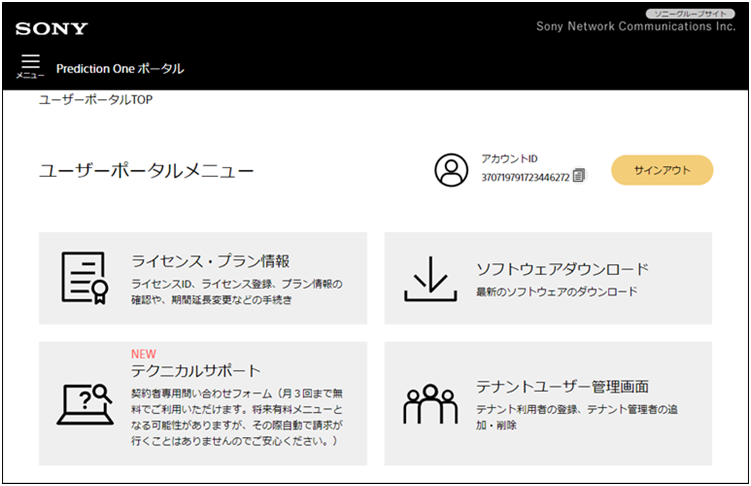
          
ユーザポータル画面（テナント管理画面）

        </a>
      </td>
      <td>
        <a href="setting/licence/index.html">
          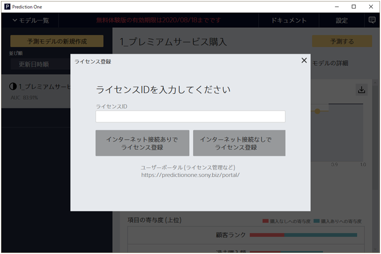
          
ライセンス登録画面

        </a>
      </td>
      
        <td>
          <a href="help/index.html">
            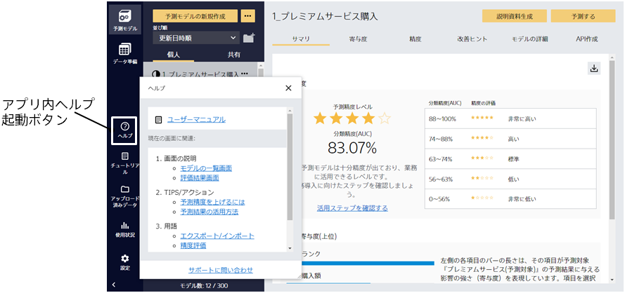
            
アプリ内ヘルプ

          </a>
        </td>
      <td>
      </td>
    </tr>
</table>

<h3>データ準備</h3>

<table class="select-screen">
    <tr>
        <td>
          <a href="data_preparation/custom/index.html">
            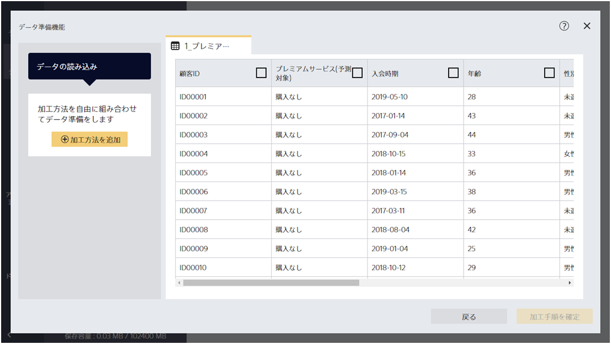
            
データ準備機能

          </a>
        </td>
        <td>
          <a href="data_preparation/data_list/index.html">
            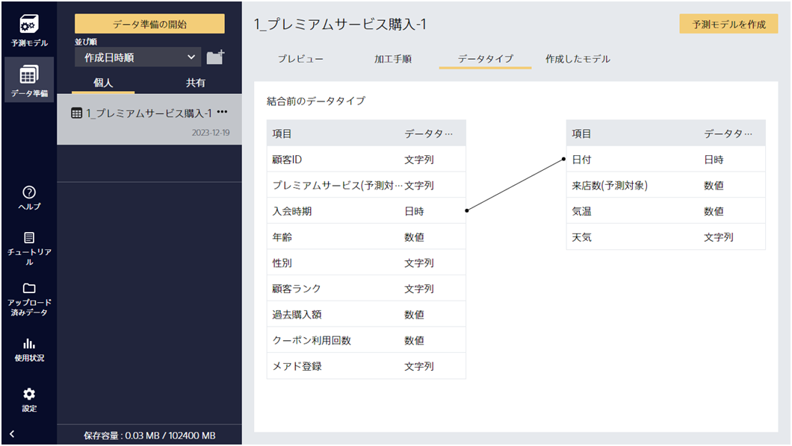
            
データ一覧画面

          </a>
        </td>
        <td>
        </td>
        <td>
        </td>
    </tr>
</table>

<h3>予測モデル</h3>
<table class="select-screen">
    <tr>
        
        <td>
          <a href="datafile/index.html">
            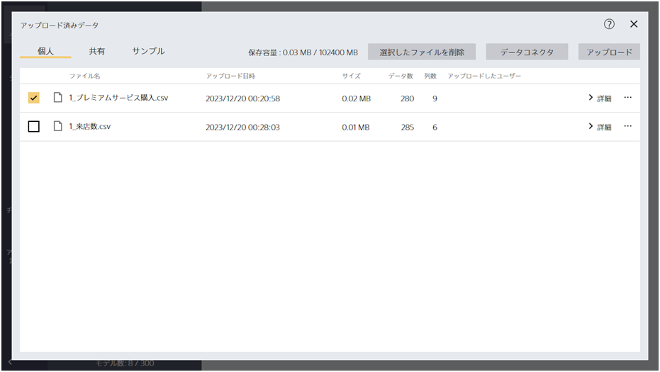
            
データ一覧画面

          </a>
        </td>
        
        <td>
          <a href="create_model/create_new_model/index.html">
            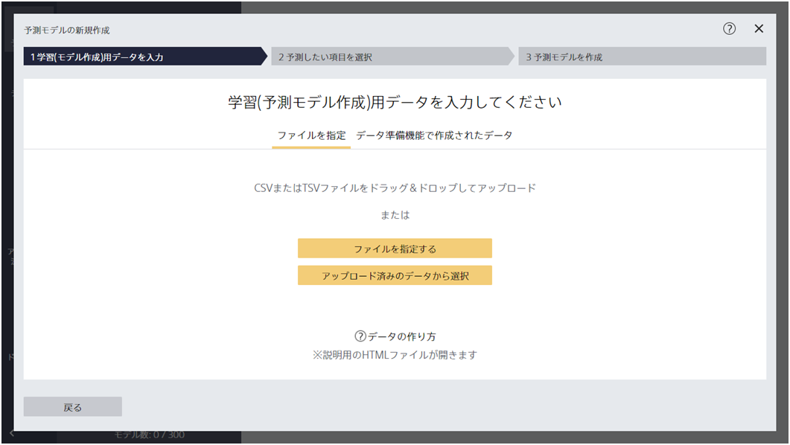
            
学習(予測モデル作成)用データ入力画面

          </a>
        </td>
        <td>
          <a href="create_model/select_target/index.html">
            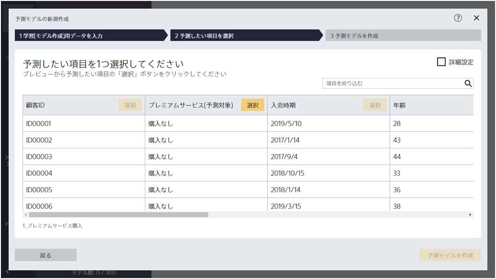
            
モデル設定画面（シンプル）

          </a>
        </td>
        <td>
          <a href="create_model/select_target_detail/index.html">
            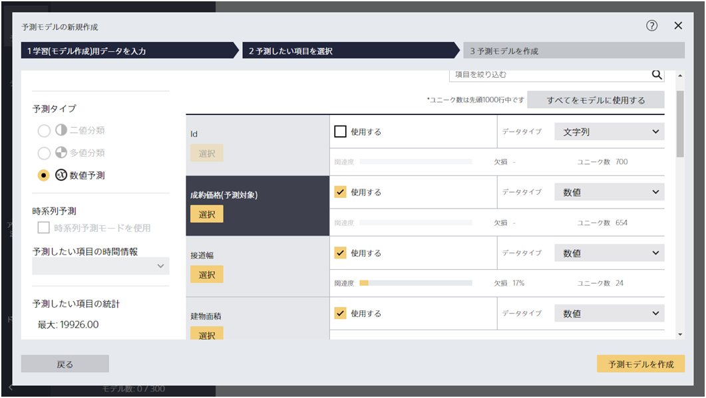
            
モデル設定画面（詳細）

          </a>
        </td>
    </tr>
    <tr>
        <td>
          <a href="result/mainresult/index.html">
            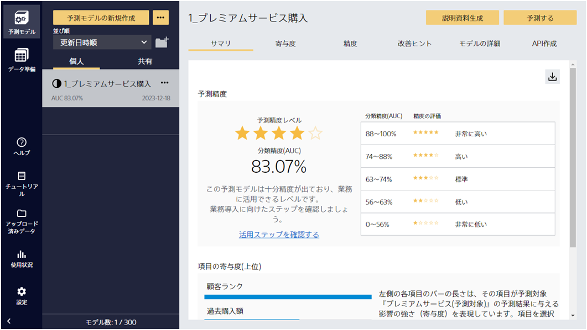
            
精度評価・寄与度画面

          </a>
        </td>
        <td>
          <a href="result/advice/index.html">
            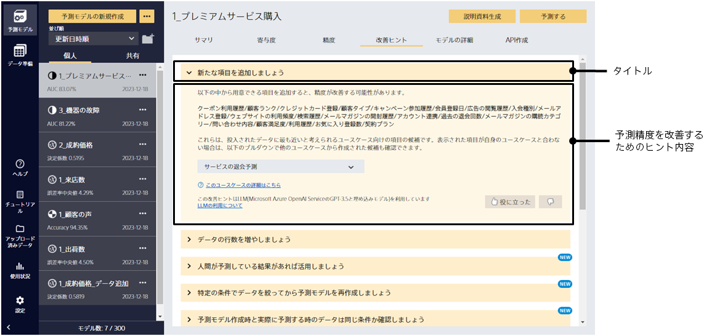
            
改善ヒント画面

          </a>
        </td>
        <td>
          <a href="prediction/prediction_input/index.html">
            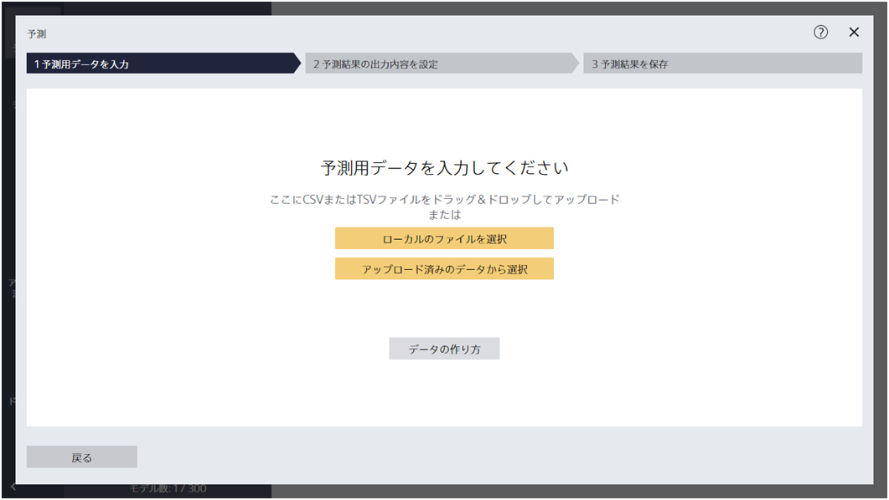
            
予測用データ入力画面

          </a>
        </td>
        <td>
          <a href="prediction/prediction_preview/index.html">
            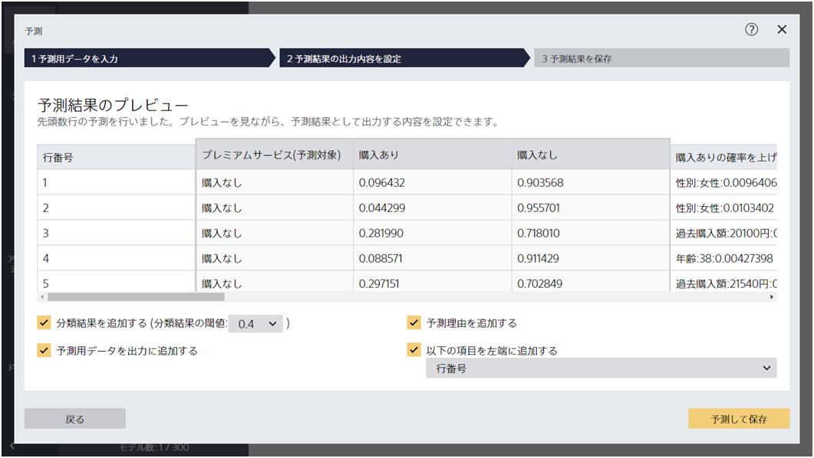
            
予測用データプレビュー画面

          </a>
        </td>
    </tr>
</table>



<h3>クラウド版機能</h3>
<table class="select-screen">
    <tr>
        <td>
          <a href="model_api/index.html">
            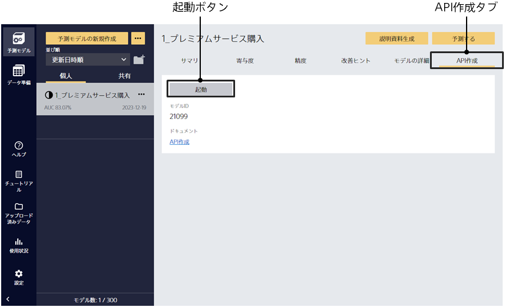
            
API作成画面

          </a>
        </td>
        <td>
          <a href="api/index.html">
            
            
予測API

          </a>
        </td>
        <td>
          <a href="model_monitor/index.html">
            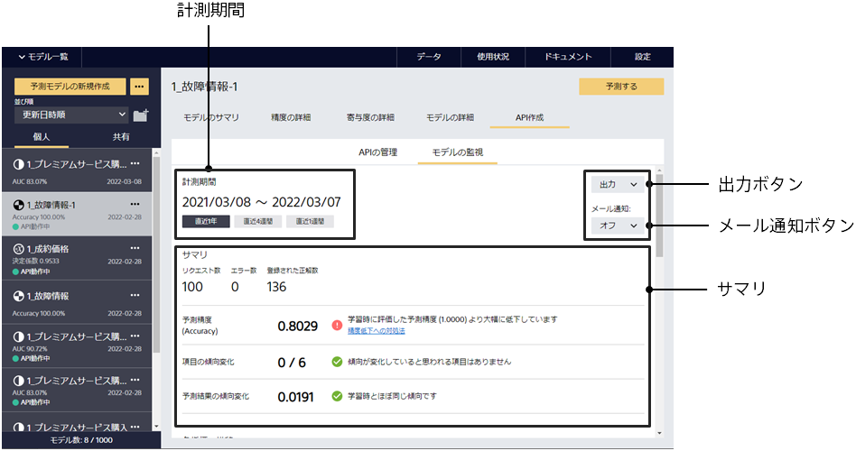
            
モデルの監視

          </a>
        </td>
        <td>
          <a href="create_slide/index.html">
            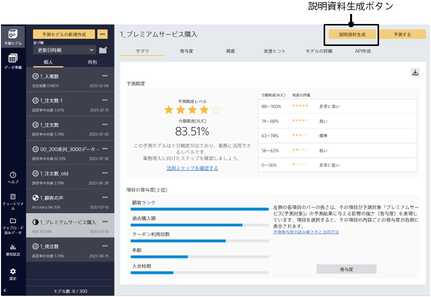
            
説明資料生成機能

        </td>
    </tr>
</table>


