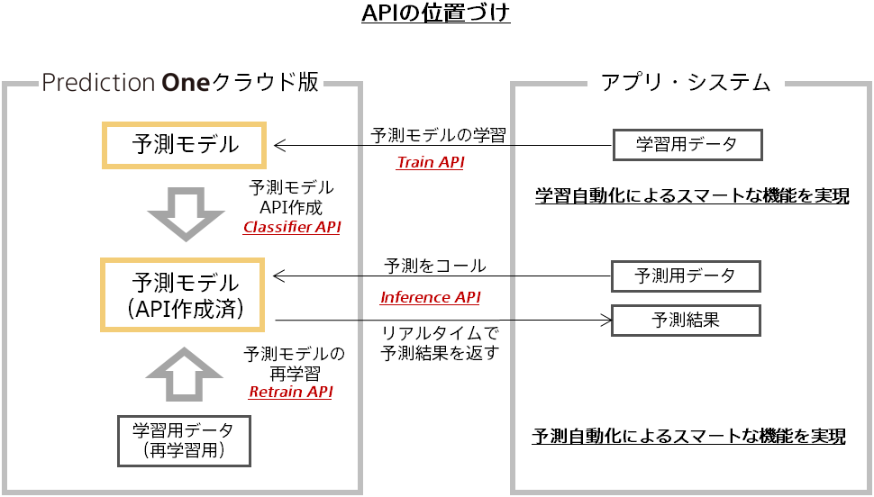

### API一覧

| No.  | カテゴリ    |  API名     | 機能概要              |
| :--- | :--------- | :--------- | :------------------  |
|1 | 学習 | {} | API KEYを取得する|
|2 | 学習 | {} | 学習用データセットをアップロードする|
|3 | 学習 | {} | 学習用データセット情報を取得する|
|4 | 学習 | {} | 予測モデルを作成する|
|5 | 学習 | {} | 学習状況を取得する|
|6 | 学習 | {} | 予測モデルを取得する|
|7 | 学習 | {} | 予測モデルを削除する|
|8 | 学習 | {} | データセットを取得する|
|9 | 学習 | {} | データセットを削除する|
|10 | 予測 | {}  | 予測データに対して作成済モデルによる予測を実行する|
|11 | 予測 | {} | 予測APIを作成する|
|12 | 予測 | {} | 予測APIを取得する|
|12 | 予測 | {} | 予測APIを更新する|
|14 | 予測 | {} | 予測APIを削除する|
|15 | 再学習 | {} | 作成済モデルに対して再学習を実行する|
|16 | 再学習 | {} | 再学習状況を取得する|
|17 | 再学習 | {} | 予測API作成済モデルの切り替えを実行する|

各APIの関係性は以下の図をご覧ください。

