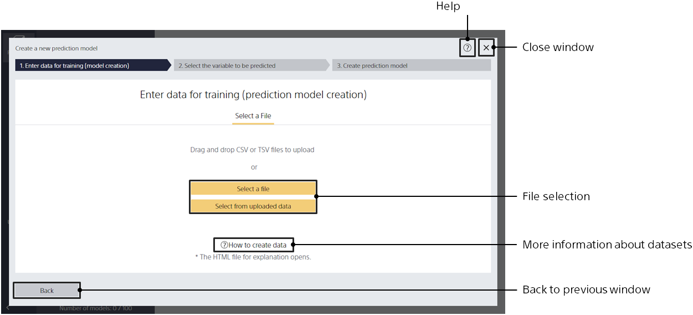

When Prediction One is running, click the [Create a New Model] button to move to this screen.

{}
{}
{}
You can specify a file by dragging and dropping it into an area in the center window. Alternatively, you can click the [Choose a File] button and specify from the file browser. The file formats are CSV (comma separated values) and TSV (tab separated values).
{}
{}
{}

{}
{}
Specify the file in one of three ways: The file formats are CSV (comma separated values) and TSV (tab separated values).

- Drag and drop the file into the area of the center window.
- Click the [Choose a File] button to specify from the file browser.
- - Click "Select from Uploaded Data" to specify from uploaded data.<u>Do this to specify sample data.</u>
  {}
  {}

{}
{}
{}

{}
You can edit the model name and description from the Model List after the model is created. You cannot edit the model name or description on this screen.
{}
