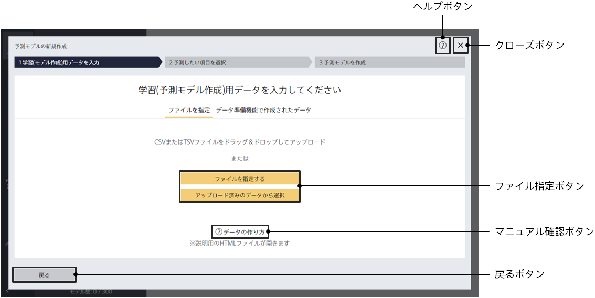

Prediction One を起動した状態で「予測モデルの新規作成」ボタンを押すとこの画面に遷移します。

{}
{}
{}
中央のウィンドウの領域にファイルをドラッグ＆ドロップすることで指定できます。別の方法として、ファイル指定ボタンをクリックし、ファイルブラウザーから指定することもできます。ファイルフォーマットは CSV(カンマ区切り)と TSV(タブ区切り)に対応しています。
{}
{}
{}

{}
{}
以下の 3 つのいずれかひとつの方法でファイルを指定します。ファイルフォーマットは CSV(カンマ区切り)と TSV(タブ区切り)に対応しています。

- 中央のウィンドウの領域にファイルをドラッグ＆ドロップします。
- 「ローカルのファイル指定」ボタンをクリックし、ファイルブラウザーから指定します。
- 「アップロード済みのデータから選択」をクリックし、アップロード済みのデータから指定します。<u>サンプルデータを指定する場合はこの操作を行います。</u>
  {}
  {}

{}
{}
{}

{}
モデル名やモデルの説明の編集は、モデルの作成が完了した後にモデル一覧から行うことができます。この画面ではモデル名やモデルの説明を編集することはできません。
{}
