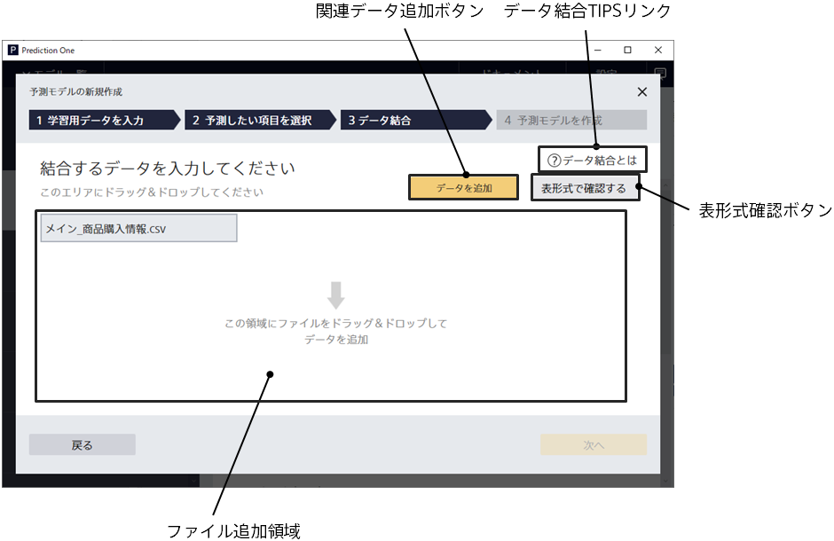
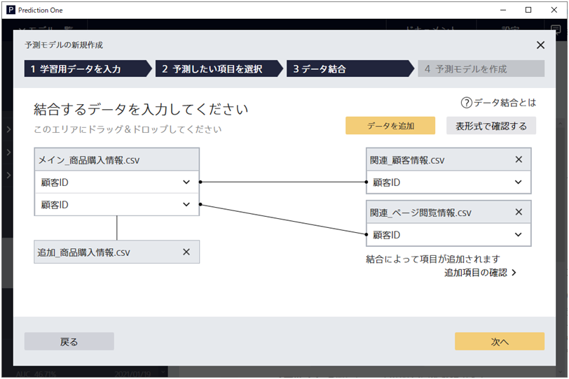
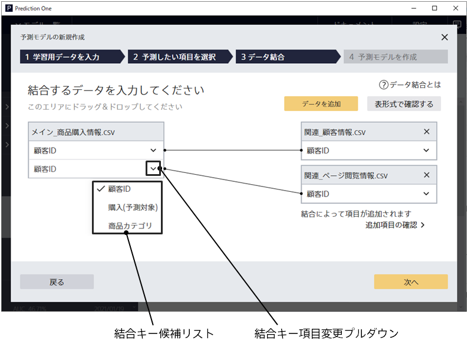
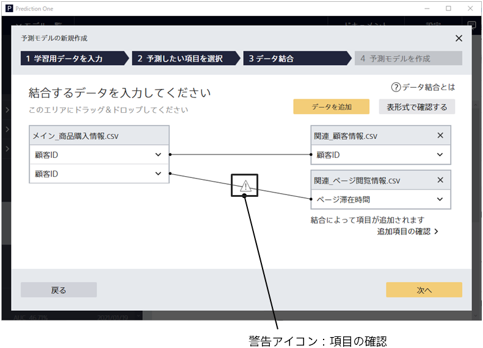
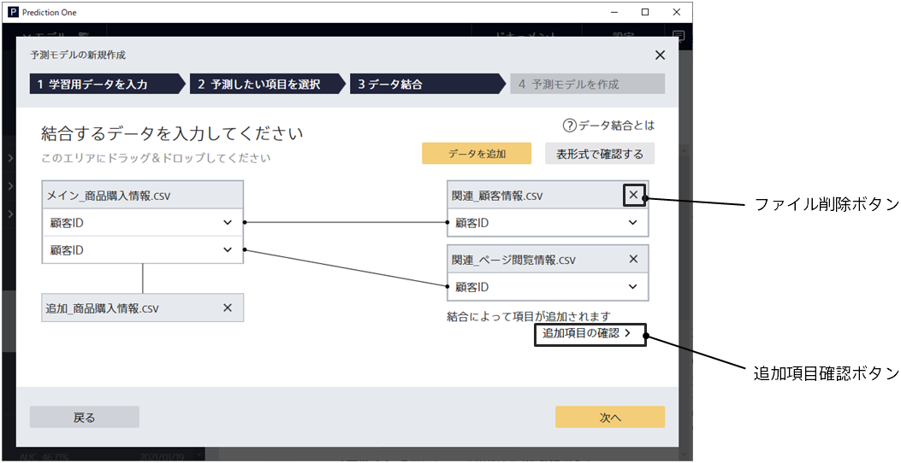
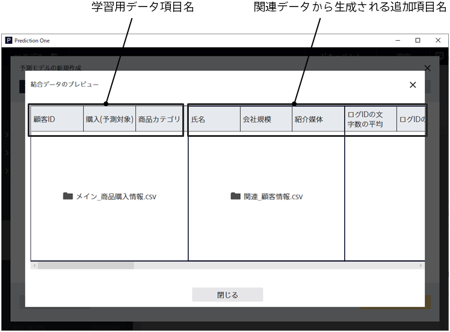

Clicking the Data Join button from the Model Settings screen will take you to this screen.
Use this screen to add additional data files related with the training data you have entered.

{}
{}
You can specify a file by dragging and dropping it into an area in the center window. Alternatively, you can click the Add Related Data button and specify it from the File Browser. The file formats are CSV (comma separated values) and TSV (tab separated values).
If there are multiple related data files, they can be added together by drag and drop.
{}
{}

Depending on the format of the added file, the join relation to the training data is displayed.

- Vertical Join - If the variable group matches the training data exactly, it is displayed below the training data.
- Horizontal Join - When training data and related data are associated through a join key variable, they appear to the right of the training data.

Refer to Tips "{}" for a detailed explanation of the join relation.
{}
{}

{}
{}
{}

{}
{}

{}

If the join keys are likely to be unmatched, a "warning icon: Check Variable" appears.
It is recommended that you verify the join key variables are correct. You can ignore the warning and go straight to learning.
{}
{}

{}
{}
{}

{}
{}
{}

- Displays the name of the joined data variables and the file name of the source file.
  Displays the training data variables entered in the training data input screen and additional variables generated from related data.
- Some of the additional variables displayed in the Preview Joined Data screen are actually used for learning.
  This is because additional variables with too many uniqueness values are excluded from the training data after the joined data is created.

{}
{}

{}
{}
This button appears when there is more than one join key variable for training data in the join key variable value of the related data being horizontally joined.

- Some of the additional variables displayed in the dialog are actually used for learning.
  This is because additional variables with too many uniqueness values are excluded from the training data after the joined data is created.
  {}
  {}
