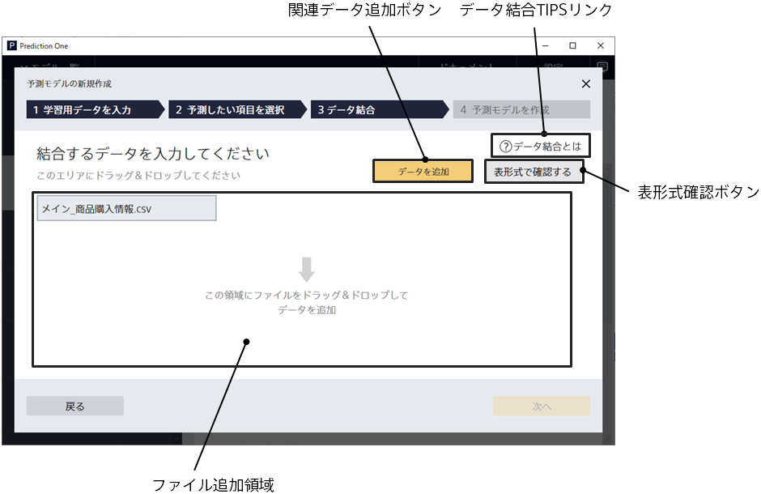
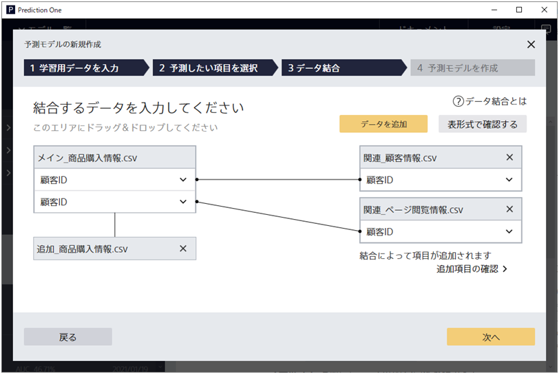
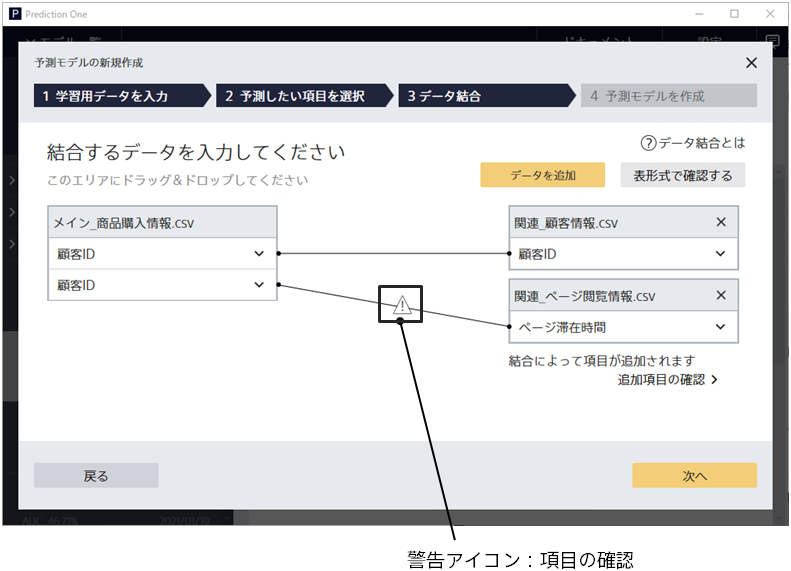
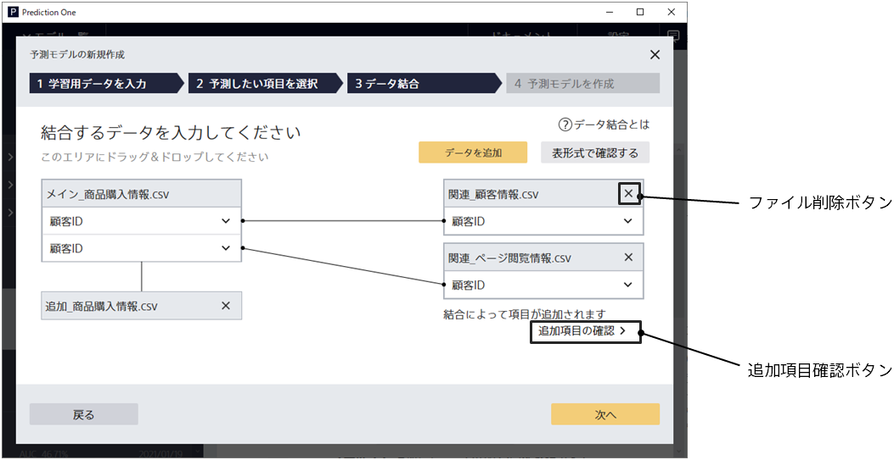
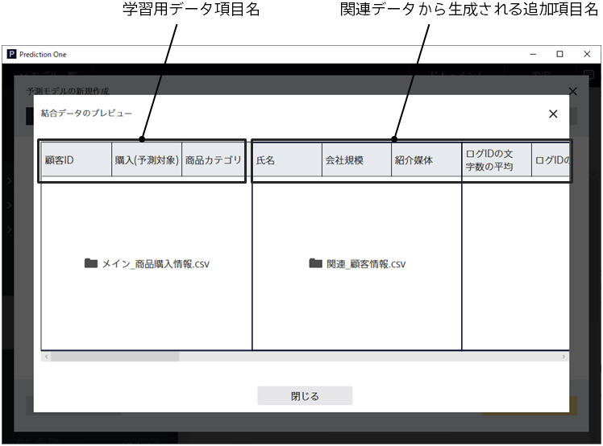

モデル設定画面からデータ結合ボタンを押すと、この画面に遷移します。
この画面では、入力した予測モデル作成(学習)用データに関連するデータファイル群を追加入力します。

{}
{}
中央のウィンドウの領域にファイルをドラッグ＆ドロップすることで指定できます。別の方法として、関連データ追加ボタンをクリックし、ファイルブラウザーから指定することもできます。ファイルフォーマットは CSV(カンマ区切り)と TSV(タブ区切り)に対応しています。
関連データファイルが複数ある場合は、まとめてドラッグ＆ドロップにより追加できます。
{}
{}

追加したファイルの形式に応じて、予測モデル作成(学習)用データに対する結合関係が表示されます。

- 縦結合：予測モデル作成(学習)用データと完全に項目群が一致する場合、予測モデル作成(学習)用データの下に表示されます。
- 横結合：予測モデル作成(学習)用データと結合キー項目を介して関連付けられる場合、予測モデル作成(学習)用データの右側に表示されます。

結合関係に関する詳細な説明は TIPS「{}」を参照してください。
{}
{}

{}
{}
{}

{}
{}

{}

結合キーの対応一致が取れない可能性が高い場合、「警告アイコン：項目の確認」が表示されます。
結合キー項目が間違っていないか、確認することをおすすめします。警告を無視してそのまま学習へ進むことも可能です。
{}
{}

{}
{}
{}

{}
{}
{}

- 結合後データの項目の名前と、結合元となるファイル名が表示されます。
  予測モデル作成(学習)用データ入力画面で入力した予測モデル作成(学習)用データ項目と、関連データから生成される追加項目が表示されます。
- 「結合データのプレビュー」画面に表示される追加項目のうち、実際に学習に使用される項目は一部となる場合があります。
  これは結合データを作成後、ユニーク数が多すぎる追加項目が予測モデル作成(学習)用データから除外されるためです。

{}
{}

{}
{}
予測モデル作成(学習)用データの結合キー項目の値が、横結合される関連データの結合キー項目値内に複数存在する場合に、このボタンが表示されます。

- ダイアログに表示される追加項目のうち、実際に学習に使用される項目は一部となる場合があります。
  これは結合データを作成後、ユニーク数が多すぎる追加項目が予測モデル作成(学習)用データから除外されるためです。
  {}
  {}
