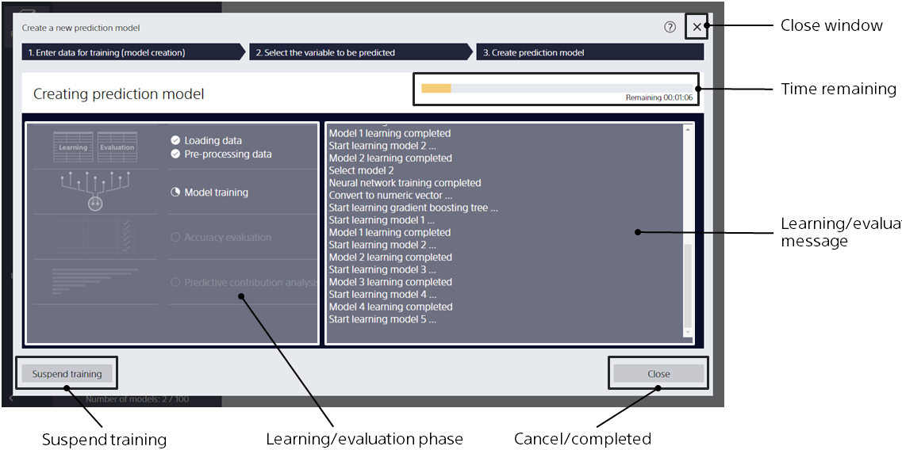
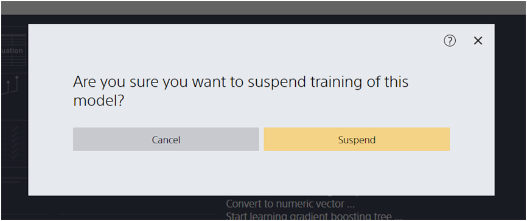

Clicking the [Create Model] button, 
takes you to this screen.

{}
{}
The estimated time remaining is displayed. There is a possibility that the estimate will be wrong.
{}
{}

{}
{}
{}
The Learning screen closes, but the modeling process is still running in the background. The Model List displays the model you are creating.
{}
{}
You can also use the "Usage" screen to check which models are learning or have completed learning.
{}
{}
{}

{}
{}
{}

If you click [Cancel], the prediction model continues to learn.
{}
{}

{}
{}
{}

{}
{}

During the learning and evaluation phase, you can see what processes are currently being performed.

- Data Import: Imports data from a file and prepares prediction model creation (training) data and evaluation data. It also estimates the processing time.
- Data Preprocessing: Calculates the required statistics for a dataset.
- Model Learning: Learn prediction models from training datasets. Prediction One uses neural networks and gradient boosting decision trees as models to automatically select the best model settings for each.
- Accuracy Evaluation: The evaluation dataset is used to calculate the prediction accuracy of the prediction model created.
- Predictive Contribution Analysis: Analyze the predictive contribution of the prediction model you have created. Not performed when using the time series prediction mode.

The learning and evaluation message displays the details of the process.
{}
{}
