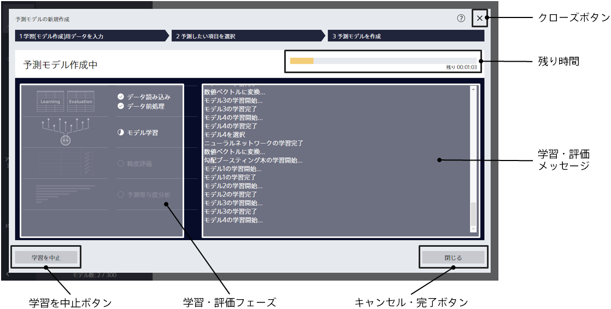
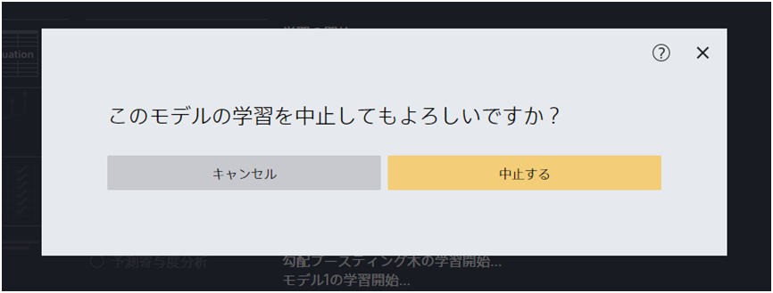

「予測モデルを作成」ボタンをクリックすると、
この画面に遷移します。

{}
{}
見積もった残り時間が表示されます。見積もりは外れる可能性もあります。
{}
{}

{}
{}
{}
学習中画面が閉じますが、バックグラウンドでモデル作成処理は実行されています。モデル一覧で作成中のモデルが表示されます。
{}
{}
他には「使用状況」画面で、学習中あるいは学習済のモデルを確認することもできます。
{}
{}
{}

{}
{}
{}

「キャンセル」をクリックした場合、予測モデルの学習は継続されます。
{}
{}

{}
{}
{}

{}
{}

学習・評価時に現在どの処理を実行しているかが学習・評価フェーズに表示されます。

- データ読み込み：ファイルからデータを読み込み、予測モデル作成(学習)用データと評価用データを準備します。処理時間の見積もりも行います。
- データ前処理：データセットについて必要な統計量を計算します。
- モデル学習：学習データセットから予測モデルを学習します。Prediction One では、モデルとしてニューラルネットワークと勾配ブースティング木を利用しており、それぞれ最適なモデル設定を自動的に選択します。
- 精度評価：評価用データセットを使って、作成した予測モデルの予測精度を計算します。
- 予測寄与度分析：作成した予測モデルの予測寄与度を分析します。時系列予測モードを使用する場合は実行されません。

学習・評価メッセージに処理内容の詳細が表示されます。
{}
{}
