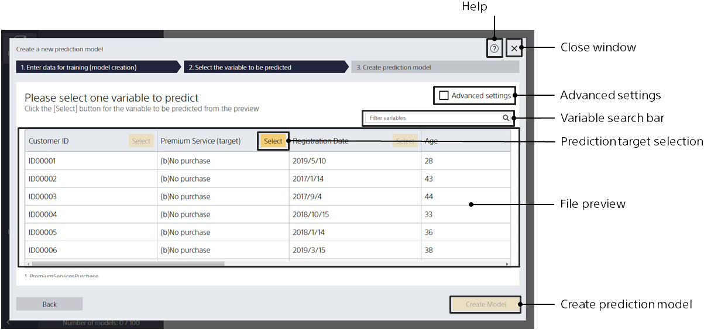

After importing the data for learning (creating a prediction model), you will be transferred to this screen. In this screen, you specify what you want the prediction model to predict.

{}
{}
If you cannot click [Select], you cannot create a prediction model that predicts the variable.
{}
{}
{}

{}
{}

- To join the relevant data to create a prediction model
- To evaluate the prediction model with pre-prepared evaluation data
- To specify the data type individually
- To do cross-validation

To review detailed settings, use the advanced setting screen.
{}
{}
{}

{}
{}
{}
