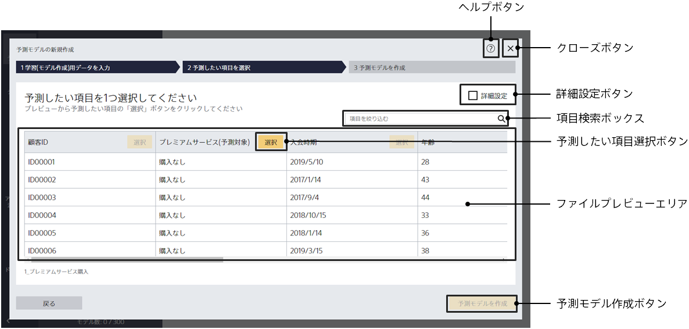

学習(予測モデル作成)用データを読み込んだ後、この画面に遷移します。この画面では、何を予測する予測モデルを作成するかを指定します。

{}
{}
「選択」を押すことができない場合、その項目を予測するような予測モデルを作成することはできません。
{}
{}
{}

{}
{}

- 関連するデータを結合して予測モデルを作成したい
- あらかじめ用意した評価用データで予測モデルを評価したい
- データタイプを個別に指定したい
- 交差検証を行いたい

などの詳細な設定を行う場合は詳細設定画面にて設定を行ってください。
{}
{}
{}

{}
{}
{}
