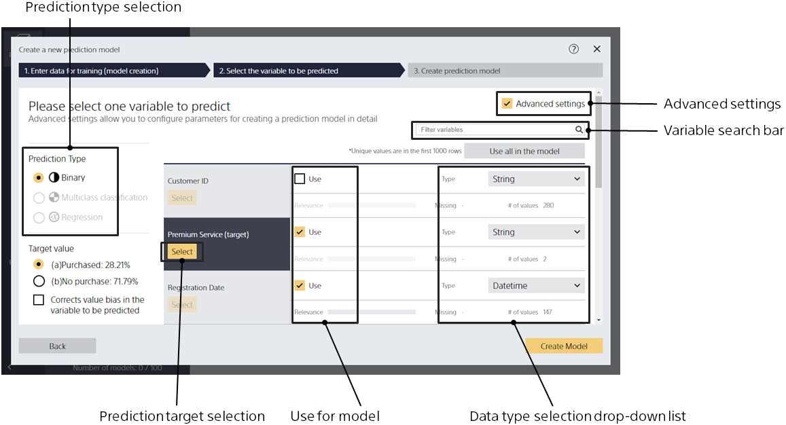
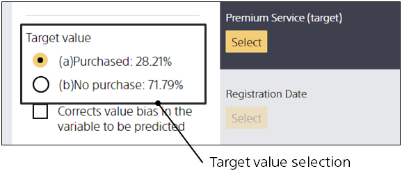
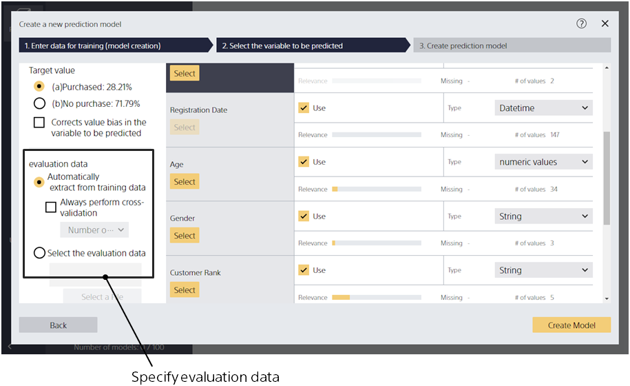
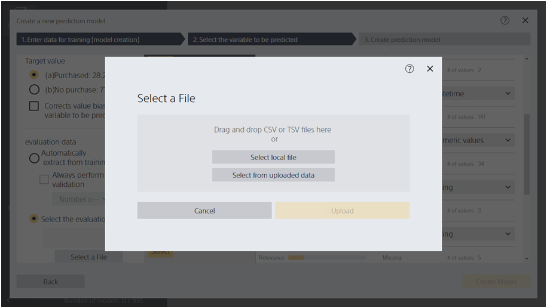
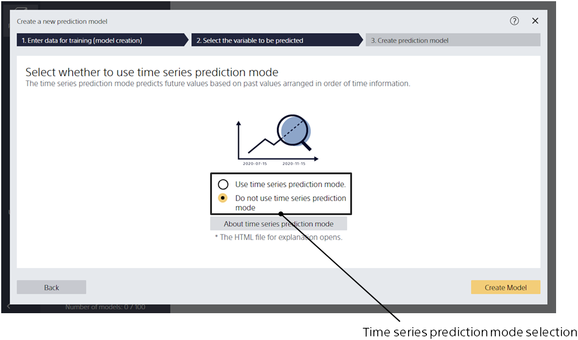
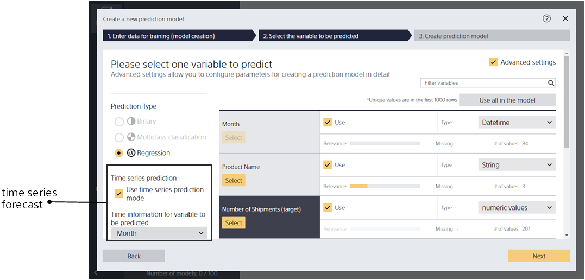

The Model Settings screen (Details) allows you to specify more advanced settings when creating a prediction model.

{}
{}
If you cannot click [Select], you cannot create a prediction model that predicts the variable.
{}
{}
{}

{}
{}
{}
The following rules automatically select a prediction type, with some exceptions: The rule uses the number of unique values (the number of possible string types), which is counted by reading the first {} rows of the prediction model creation (training) data.

- If the data type of the variable to be predicted is a string
  - If the number of unique values in the item is 2, binary classification is applied.
  - If the number of unique values is greater than or equal to 3 and less than or equal to {}, multiclass classification is applied.
  - If the number of unique values is greater than {}, Prediction One does not support multiclass classification. Change the number of unique values to {} or less by modifying or processing the data.
- If the data type of the variable to be predicted is numeric
  - If the number of unique values in the item is 2, binary classification is applied.
  - If the number of unique values is greater than or equal to 3 and less than or equal to {}, you can choose between multiclass classification and regression.
  - If the number of unique values is greater than {}, it is regression.
- If binary classification is selected and the variable you want to predict after {} line contains another value, the learning fails prematurely and ends. When multiclass classification is selected and the number of unique values to be predicted for processing including data after {} line exceeds {}, the learning fails and ends prematurely.

{}
{}

{}
{}
Variables with too many unique values often have a negative impact on learning (over-fitting and poor predictive accuracy), so they are unchecked by default. If there are too many variables, type text in the variable search box to narrow the variables that appear in the variable list.
{}
{}

{}
{}

You can select and change target values by selecting Binary Classification as the prediction type. Please check the value you want to predict. In the evaluation after learning, an evaluation graph or similar is generated centering on the value 
that is checked. 
{}
{}

{}
{}
On the Model Settings screen (Details), relevance scores can be checked only for data types that are numeric or string.
The relevance score visualizes how much of a trend or correlation is found by comparing the variable to predict and another variable, and the higher the score, the greater the correlation.


For more information on how to use the relevance score, see {}.

{}

{}
{}

{}
{}

In this case, all prediction model creation (training) data is used for learning and the specified evaluation data is used for evaluation.
All variables in the evaluation data and the prediction model creation (training) data must match. Otherwise, the learning and evaluation process will fail.
{}
{}

{}
{}
{}
{}

If no evaluation data is specified and the number of rows is greater than 500, Prediction One divides the data into 9:1, uses 90% of the data for learning, and uses 10% of the data for evaluation.
If no evaluation data is specified and the number of rows is less than or equal to 500, a two-part cross-validation is performed.
(The data is divided into two parts, which are used for prediction model creation (training) data and evaluation data respectively, and two patterns of learning and evaluation are performed to calculate evaluation values.)

By checking [Cross-validation], you can always perform cross-validation regardless of the data count.
You can specify the number of divisions by selecting from the pull-down.

{}
{}

{}
{}
You can join data to create a prediction model, even if the related data is in separate files.
For a detailed explanation of joining data, see  TIPS "{}".
{}
{}
The data join feature is not available in the current version.
{}
{}

{}
{}
{}
{}

#### Specifying in normal screen transitions

The screen to select whether to use the time series prediction mode is displayed.
Select "Use Time Series Prediction Mode" and Click [Next].

---

#### Specifying from the advanced settings screen

If regression is selected as the prediction type, checking the Time Series Prediction Mode will enter the time series prediction mode.
If you use Time Series Prediction Mode, you cannot specify data for evaluation or cross-validation.
To use the time series prediction mode, the incoming data set must meet multiple criteria, but the prediction may be more accurate.<u>The area for specifying the time series prediction mode is not displayed if there are no datetime variables in the prediction model creation (training) data. </u>

If you check the time series prediction mode, the [Create Model] button changes to the [Next] button,
and you will be able to move to the time series prediction setting screen.
If there are multiple time information variable candidates for the item you want to predict, 
select the correct candidate from the time information pull-down list for the variable you want to predict.
{}
{}

{}
{}
This option can only be specified for binary or multiclass classification.
When this option is enabled, the model is trained to predict the values of the variables you want to predict, especially those that occur less frequently.
This option may reduce the accuracy of the classification. Also, this option may not improve prediction accuracy for data with fewer occurrences.
{}

