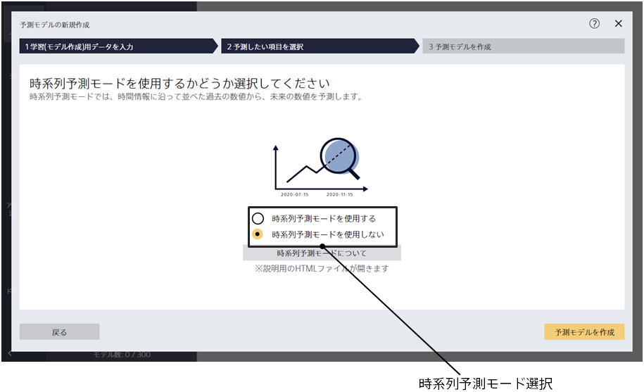

モデル設定画面（詳細）では予測モデルを作成する際により詳細な設定を指定できます。

{}
{}
「選択」を押すことができない場合、その項目を予測するような予測モデルを作成することはできません。
{}
{}
{}

{}
{}
{}
一部を除き、以下のルールで自動的に予測タイプが選択されます。ルールは値のユニーク数(取り得る文字列の種類の数) を利用するのですが、ユニーク数は予測モデル作成(学習)用データの先頭{}行を読み込んでカウントしています。

- 予測したい項目のデータタイプが文字列型の場合
  - 項目内の値のユニーク数が 2 の場合は二値分類となります。
  - ユニーク数が 3 以上{}以下の場合、多値分類となります。
  - ユニーク数が{}より多い場合、Prediction One は多値分類に対応していません。データを変更・加工するなどし、{}以下に変更してください。
- 予測したい項目のデータタイプが数値型の場合
  - 項目内の値のユニーク数が 2 の場合は二値分類となります。
  - ユニーク数が 3 以上{}以下の場合、多値分類と数値予測が選択できます。
  - ユニーク数が{}より多い場合、数値予測となります。
- 二値分類が選択され、{} 行目より後に予測したい項目に別の値が含まれる場合、学習が途中で失敗して終了します。多値分類が選択され、{}行目より後のデータも含めた処理時に予測したい項目のユニーク数が{}を超えると、学習が失敗して途中で終了します。

{}
{}

{}
{}
ユニーク数が多すぎる項目は学習に悪影響を与える(過学習が起きて予測精度が悪くなる)ことが多いので、デフォルトでチェックを外しています。項目数が多すぎる場合は、項目検索ボックスに文字を入力すると、項目リストに表示される項目を絞ることができます。
{}
{}

{}
{}

予測タイプとして二値分類を選択すると、予測値を選択・変更できます。予測したい方をチェックしてください。学習後の評価において、チェックされた方を中心に評価グラフ等が生成され
ます。
{}
{}

{}
{}
モデル設定画面の詳細画面では、データタイプが数値・文字列であるものに限り関連度スコアを確認できます。
関連度スコアは予測したい項目とその項目を比較した時にどれくらい傾向や対応関係があるかを可視化したものであり、高ければ高いほど対応関係があります。


関連度スコアの活用方法については{}をご確認ください。

{}

{}
{}

{}
{}

この場合、予測モデル作成(学習)用データはすべて学習に利用され、指定された評価用データを評価に利用するようになります。
評価用データと予測モデル作成(学習)用データは項目がすべて一致している必要があります。一致していない場合、学習・評価の処理が失敗します。
{}
{}

{}
{}
{}
{}

Prediction One では、評価用データが指定されておらず、データ数が 500 より大きい場合、データを 9：1 に分割し、9 割のデータを学習に利用し、1 割のデータを評価に利用します。
評価用データが指定されておらず、データ数が 500 以下の場合、2 分割交差検証が実行されます。
(データを 2 分割し、それぞれを予測モデル作成(学習)用データ、評価用データとして学習と評価を 2 パターン行い、評価値を算出します。)

「必ず交差検証を行う」をチェックすることによって、データ数によらず、必ず交差検証を実行できます。
その際、分割数をプルダウンから選択することで指定できます。

{}
{}

{}
{}
関連するデータが別のファイルに分かれている場合でも、データを結合して予測モデルの作成を行うことができます。
データ結合に関する詳細な説明は TIPS「{}」を参照してください。
{}
{}
現在のバージョンでは、データ結合機能を利用できません。
{}
{}

{}
{}
{}
{}

#### 通常の画面遷移での指定

時系列予測モードを使用するかどうかの選択を行う画面がでます。
「時系列予測モードを使用する」を選択して、「次へ」を押してください。

---

#### 詳細設定画面からの指定

予測タイプとして、数値予測が選択されている場合、時系列予測モードチェックをチェックすると時系列予測モードとなります。
時系列予測モードを使用する場合は、評価用データ指定や交差検証はできません。
時系列予測モードを使用するには、入力となるデータセットが複数の条件を満たす必要がありますが、予測精度が高くなる可能性があります。<u>時系列予測指定の領域は、予測モデル作成(学習)用データに日時型の項目が存在しない場合は表示されません。</u>

時系列予測モードチェックをチェックすると、「予測モデルを作成」ボタンが「次へ」ボタンに変化し、
時系列予測設定画面に遷移できるようになります。
予測したい項目の時間情報項目の候補が複数ある場合は、
予測したい項目の時間情報プルダウンから正しいものを指定してください。
{}
{}

{}
{}
このオプションは二値分類か多値分類を行う時のみ指定することができます。
このオプションが有効の時、予測したい項目に含まれる値の中で特に出現回数が少ないものをなるべく予測できるようにモデルを学習します。
このオプションを指定すると分類の正解率(Accuracy)が低下する可能性があります。また、このオプションを指定しても出現回数の少ないデータに対する予測精度が向上しない場合もあります。
{}

