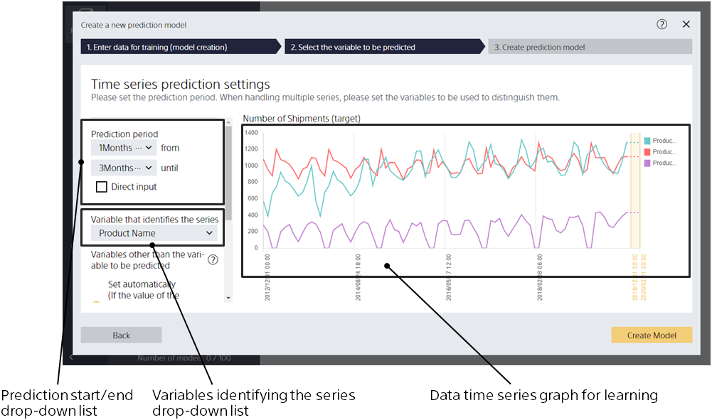
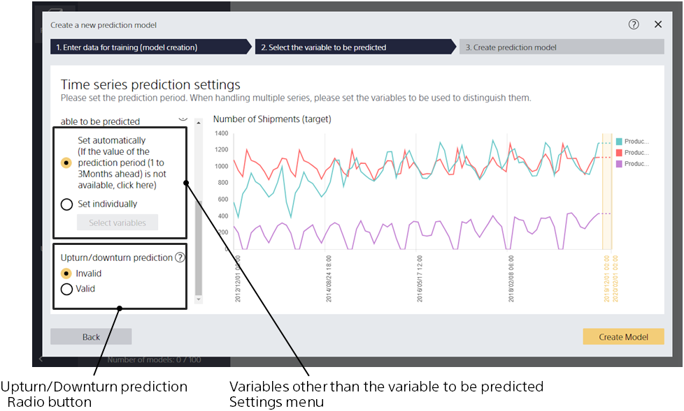
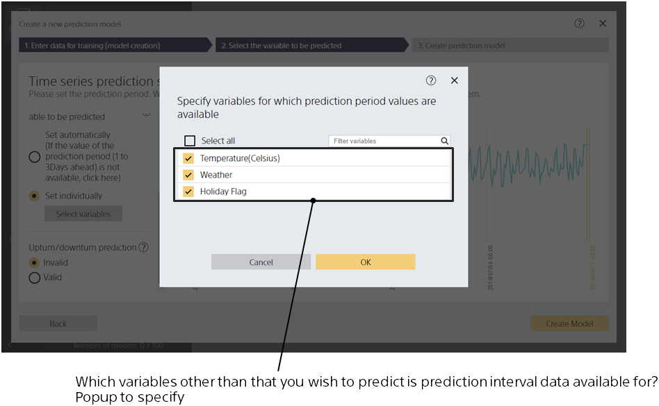

If the time series prediction mode is specified, this screen is displayed.
Use this screen to specify how far ahead the prediction model can predict
and whether prediction interval data is available for variables other than that you wish to predict. 

{}
In the cloud version, you can also specify whether to enable upturn/downturn prediction.

{}

{}
{}
You can only predict after learning for the period you specify here.
You can also enter a value directly by checking [Direct input].
Prediction End Time must be greater than or equal to the Prediction Start Time.
If the prediction period is too long for the length of the prediction model creation (training) data,
the prediction period may not be specified or the learning and evaluation process may fail.
{}
{}

{}
{}
{}

{}
{}

Used for cases where additional information other than time information variables or variables to be predicted have been added as data for training (model creation). 
If prediction interval values are not available for the information you have added, select "Set Automatically". 
If prediction interval values are available for the information you have added, choose from "Set Individually". 
If there is no information added, only "Set Automatically" can be selected. 
For details see {}.
{}
{}

{}
{}
{}
For details on the upturn/downturn prediction feature, see the "{}" page.
{}
{}
{}

{}
{}
{}
