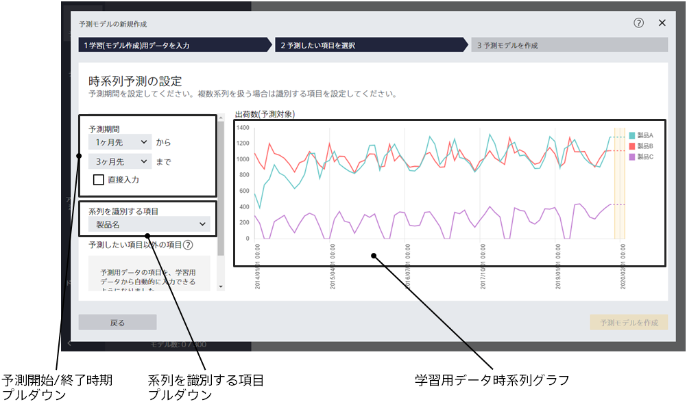
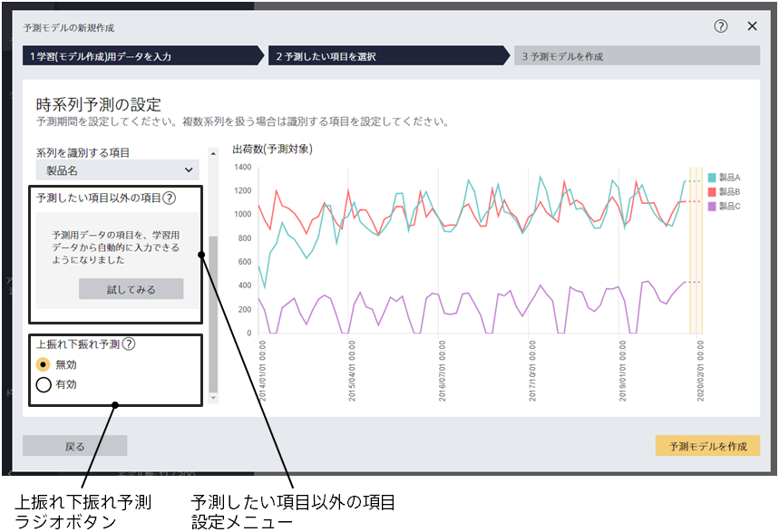
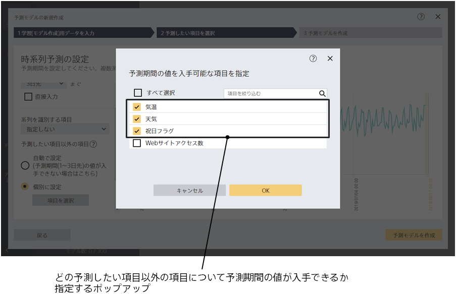

時系列予測モードを指定した場合、この画面に遷移します。
この画面では、予測モデルがどれくらい先を予測できるようにするか、
予測したい項目以外の項目について予測期間のデータが手に入るかを指定します。

さらに上振れ下振れ予測を有効にするかどうかもこの画面で指定します。

{}
{}
ここで指定した期間のみ、学習後に予測を行うことができます。
また、直接入力チェックをチェックすると、直接数値を入力できます。
予測終了時期は予測開始時期と同じかそれより後である必要があります。
予測モデル作成(学習)用データの長さに対して、予測期間が長すぎる場合は、
予測期間が指定できなかったり、学習・評価の処理が失敗したりする可能性があります。
{}
{}

{}
{}
{}

{}
{}

学習 (モデル作成) 用データとして時間情報項目や予測したい項目以外に、情報を追加したケースに使用します。 
追加した情報についても予測期間の値が手に入らない場合は、「自動で設定」を選択します。 
追加した情報については予測期間の値が手に入る場合は、「個別に設定」から手に入る項目を選択します。 
追加する情報がない場合は「自動で設定」のみ選択できます。 
詳細については、{}を参考にして下さい。
{}
{}

{}
{}
上振れ下振れ予測機能についての詳細は、「{}」のページを参考にしてください。
{}
{}

{}
{}
{}
