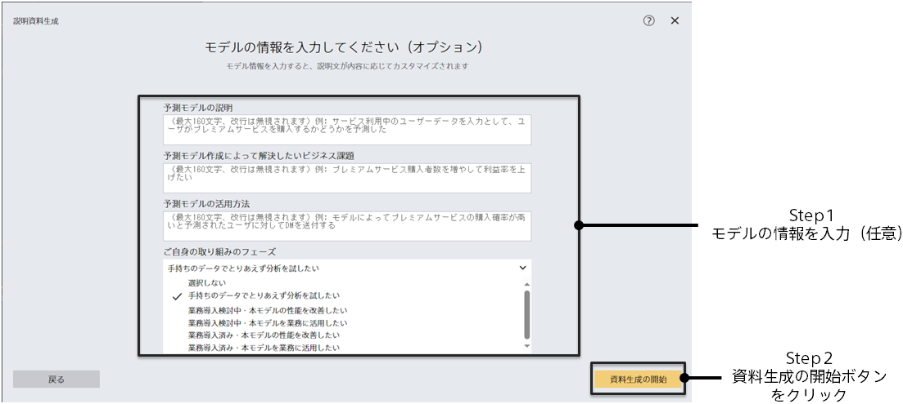
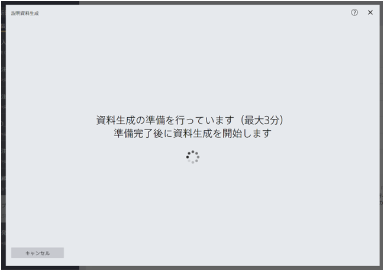
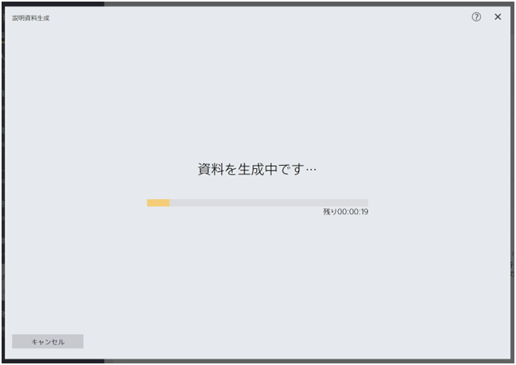
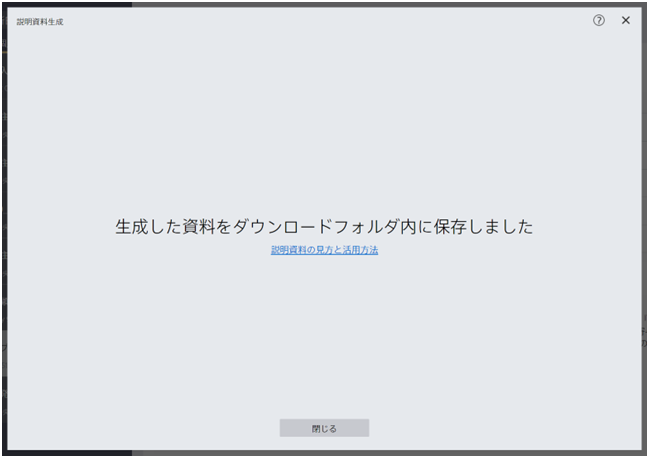

---
title: "説明資料生成機能"
date: 2023-12-11T11:02:05+06:00
lastmod: 2023-12-11T10:42:26+06:00
weight: 9
draft: false
# metaタグのパラメータ
meta:
  description: ""
# クラウド・デスクトップ限定ページの場合は片方のみtrueにする
visible:
  is_cloud_only: false
  is_desktop_only: false
# 検索でヒットする文字列の指定
keywords: ["説明資料生成機能", "資料生成", "スライド", "パワポ", "powerpoint", "パワーポイント", "資料"]
---

説明資料生成機能とは予測モデルに関する情報を自動でスライドにまとめて出力することのできる機能です。生成される説明資料の内容については{}のページをご参照ください。本資料ではこの機能の使用方法をご説明します。

{}
モデルの評価画面の右上にある「説明資料生成」ボタンをクリックすると説明資料生成のダイアログが開始します。

ダイアログの最初の画面は以下の画像のようになっており、本機能について簡単に説明しています。

{}

{}
「次へ」ボタンをクリックすると「モデルの情報を入力してください」という画面に遷移します。この画面は作成したモデルとそれを適用しようとしているビジネスに関する情報を記入するテキストボックスによって構成されています。

記入いただける情報は以下の通りです。
- 予測モデルの説明 
  予測モデルにどのようなデータを入力したか、どのような値が出力されるのか、どのような設定を行ったのか等を記入します。
- 予測モデル作成によって解決したいビジネス課題 
  予測モデルを作成するに至ったビジネス上の背景や、予測モデルを作成することによってどのようなビジネス課題を解決したいのかを記入します。
- 予測モデルの活用方法 
  予測モデルの寄与度や予測結果をビジネスのどのような場面でどのように活用されるのか、想定されるシナリオを記述します。
- ご自身の取り組みのフェーズ 
  モデルの作成について、またその業務導入に関してどのような段階にあるのか、自身の認識に最も近いものを選択します。

以上の情報の記入は任意です。記入いただくことで生成される資料内容がより取り組みの状況に即した内容となります。

{}
記入完了後、右下の「資料生成の開始」ボタンをクリックすると資料生成が開始されます。
{}

{}
記入完了後、右下の「資料生成して保存」ボタンをクリックするとエクスプローラーが起動します。ファイルの保存場所とファイル名を記入すると自動で資料生成が開始されます。
{}
{}

{}
{}
一度資料生成が開始されると自動で処理が進みます。はじめに資料生成に必要な準備を行い、準備は最大3分程度かかります。準備が完了すると資料生成が開始されます。資料生成の所要時間は項目数や系列数によって変動します。

資料生成が完了すると自動でブラウザによって資料がダウンロードされ、ダウンロードフォルダに資料が保存されます。以下の画面が表示されると説明資料生成は完了です。

{}
{}

{}
{}
一度資料生成が開始されると自動で処理が進みます。資料生成が完了すると以下のような画面が表示され、先ほど指定した場所に資料が保存されます。

{}
{}