「データ準備機能」ボタンをクリックするとこの画面に遷移します。
「データ準備を開始」をクリックし、データセットとなるファイルを入力してください。

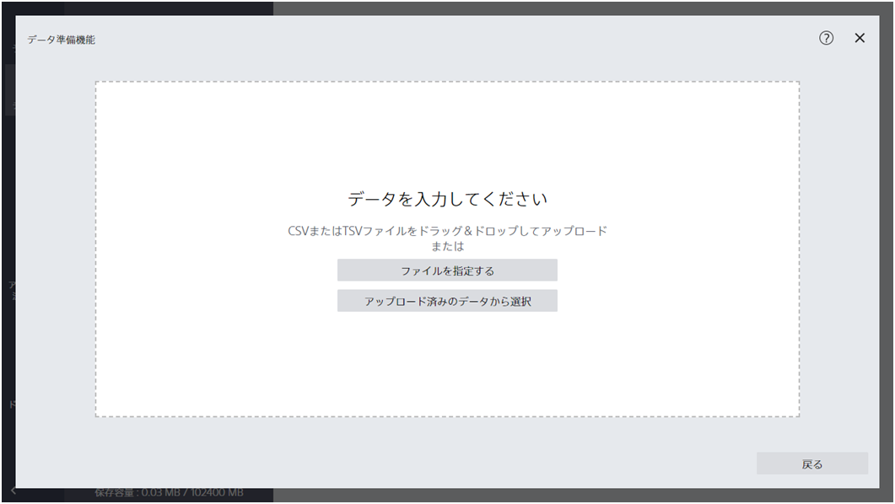

{}
{}
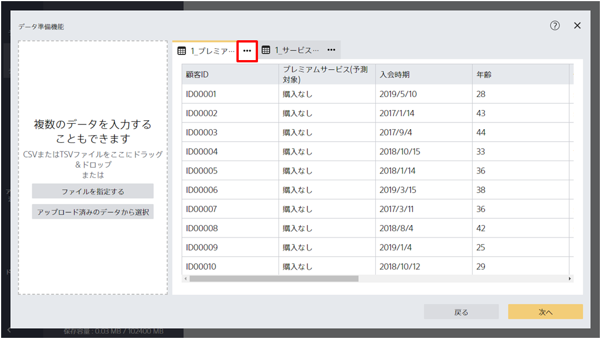
{}

{}
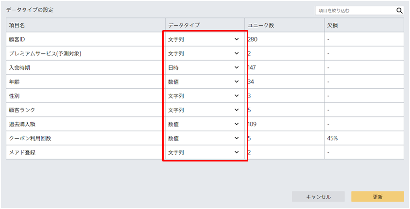
  データタイプを確定したあと、「更新」をクリックしてください。
  
  データタイプごとに指定できる加工処理は異なります。
  データタイプごとにどの加工が指定できるかは[このページ](index.html)をご参照ください。
  
{}
{}

{}
{}
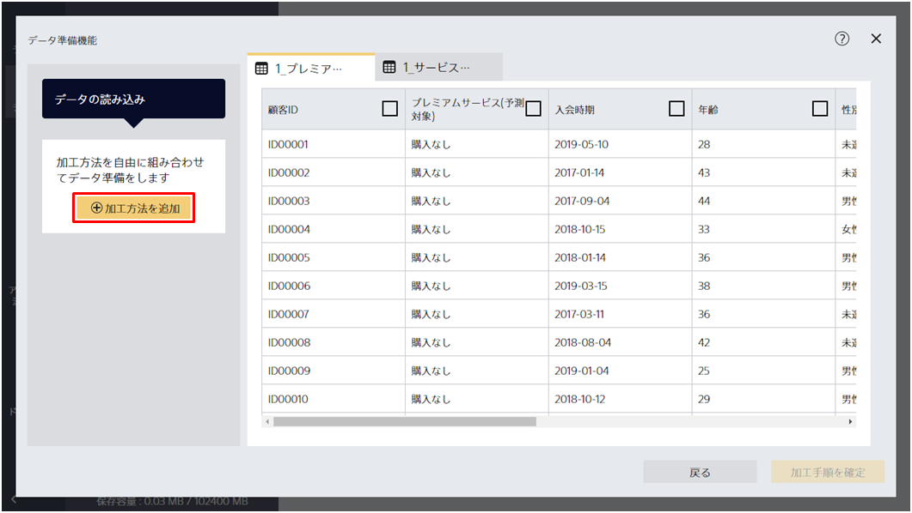
{}

{}
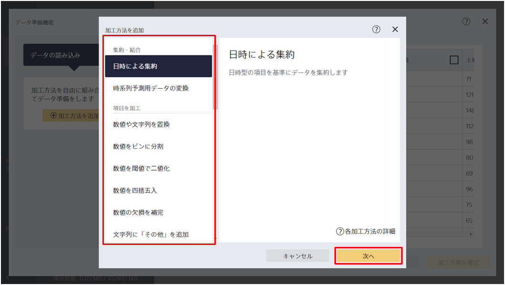
{}

{}
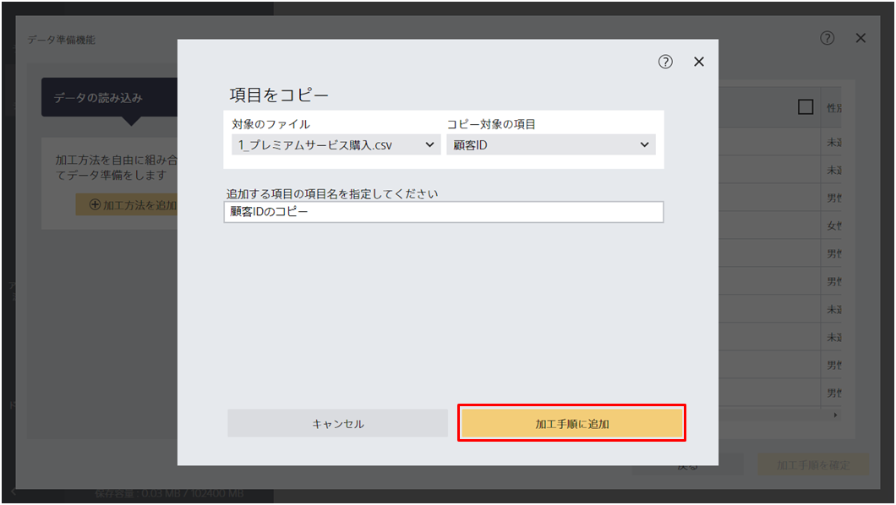
{}
{}

{}
{}
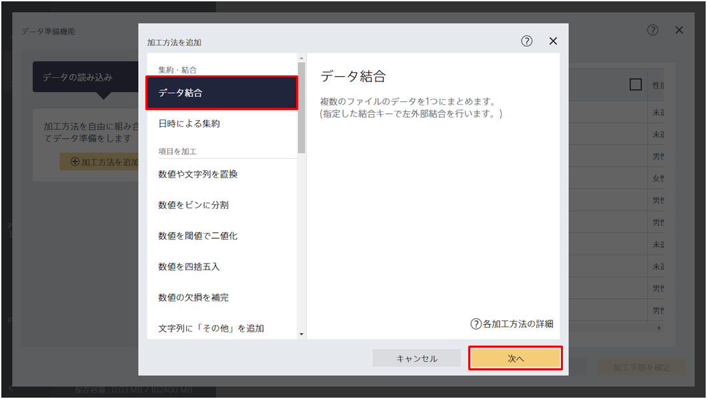
{}

{}
「予測したい項目が含まれるファイル」とは左外部結合をする際の左側のテーブルに相当するファイルを指しています。
結合関係を指定後、「次へ」をクリックしてください。

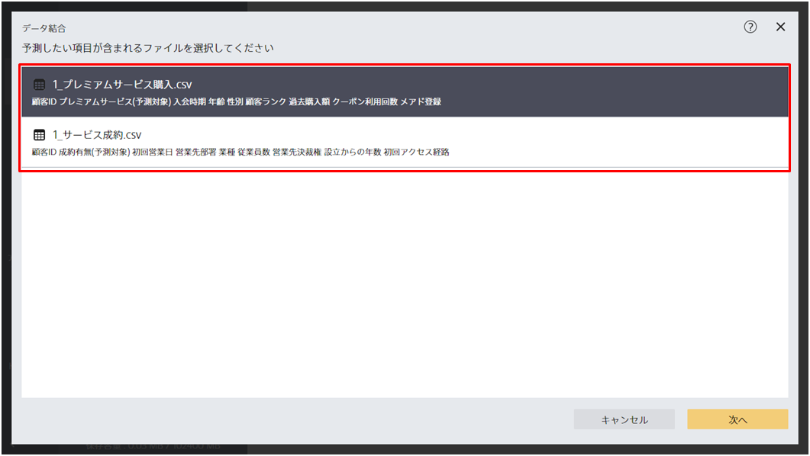
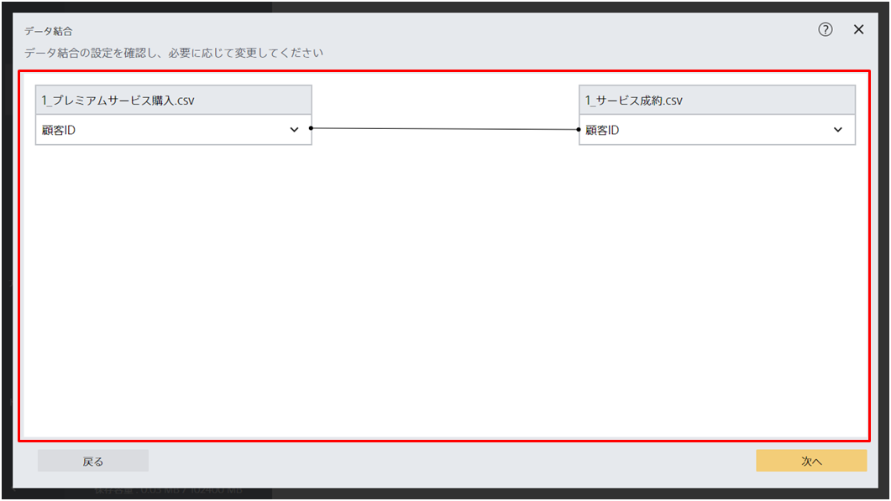
{}

{}
この画面では、データ結合時に各項目をどのように集約するかを指定できます。

- 合計：ある項目に紐づく行が複数ある場合、それらの行の値を合計します
- 平均：ある項目に紐づく行が複数ある場合、それらの行の値の平均を求めます
- 先頭の値：ある項目に紐づく行が複数ある場合、先頭の行に含まれる値を採用します
- ユニーク数：ある項目に紐づく行が複数ある場合、それらの行の値のユニーク数を求めます
- 個数：ある項目に紐づく行が複数ある場合、それらの行数を求めます

項目ごとに集約方法を指定したら「次へ」をクリックすればデータ結合は完了します。

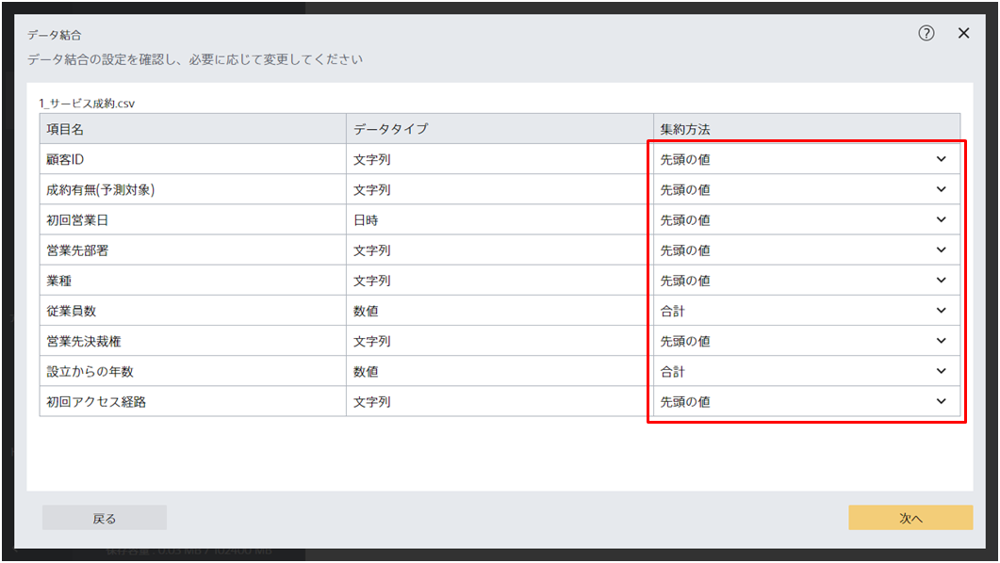
{}

{}

{}
{}
「日時による集約」を行うためには最低1つ以上の日時項目が含まれている必要があります。
{}

{}
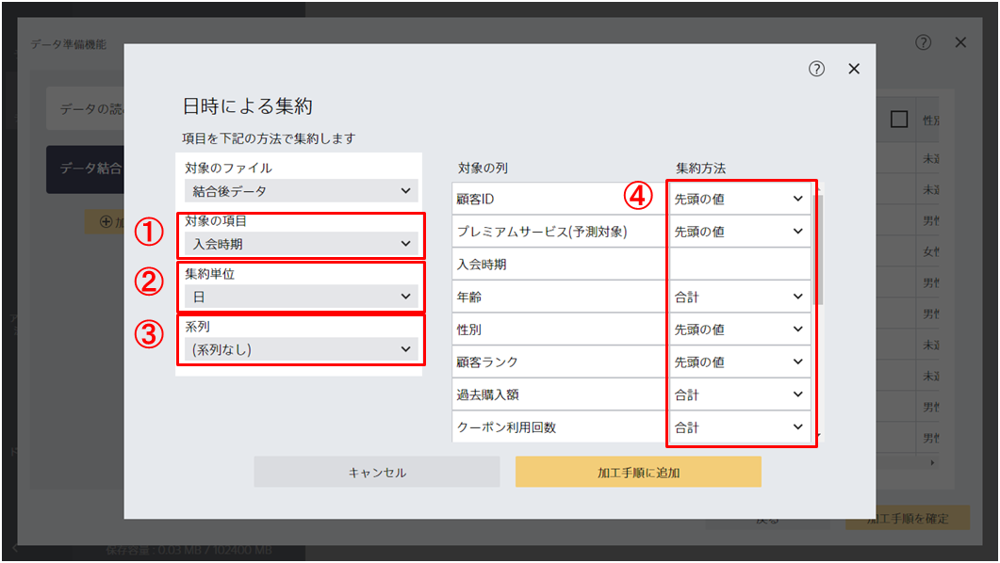

この画面では以下の設定ができます。

- ①集計の基準となる日時項目の指定
- ②集計する際、何日毎に集計するかの指定
- ③系列がある場合は系列が記録された項目の指定
- ④集約時の集計方法の指定
{}
{}