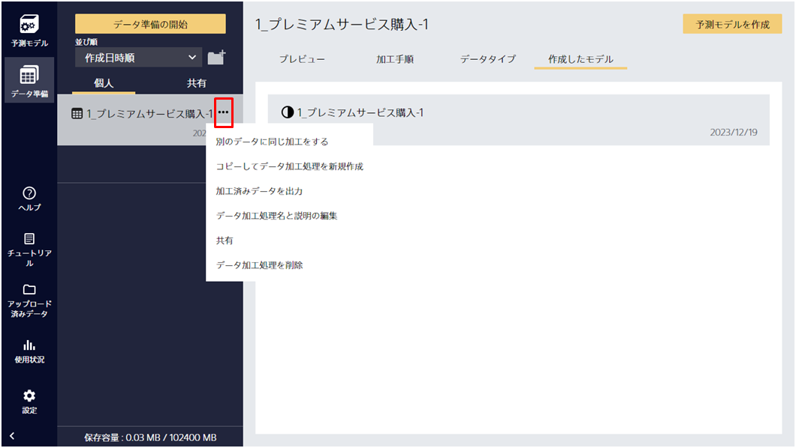

データの加工処理が終わり、予測モデルを作成する準備ができているデータの一覧です。

この画面では以下の情報を確認できます。

- プレビュー：加工したデータのプレビューです
- 加工手順：元のデータをどのような手順で加工したかの詳細を確認できます
- データタイプ：元のデータの各項目のデータタイプを確認できます
- 作成したモデル：この加工済みデータから作成した予測モデルを確認できます

また、加工済みのデータに対して以下のような操作ができます。

- 別のデータに同じ加工をする：**項目名がすべて同じ**データに対して、同じ加工処理を適用します
- コピーしてデータ加工処理を新規作成 (データ準備機能)：加工処理が同じデータをデータ準備機能で新しく作成します
- データ加工処理をエクスポート：データ加工処理の設定をエクスポートします
- 加工済みデータを出力：データ加工した結果をcsv形式で出力します
- データ加工処理名と説明の編集：データ加工処理に対して名前と説明テキストを付与することができます
- お気に入りに追加（お気に入りから削除）：お気に入りに追加します。お気に入りに追加されたデータは、作成日時やデータ加工処理名に関係なく上位に固定して表示されます。
- データ加工処理を削除：データ加工処理を削除します

データ加工処理を利用している予測モデルが1つ以上ある場合、そのデータ加工処理は削除できません。
「作成した予測モデル」の欄を確認し、1つも予測モデルが無い場合のみそのデータ加工処理を削除できます。