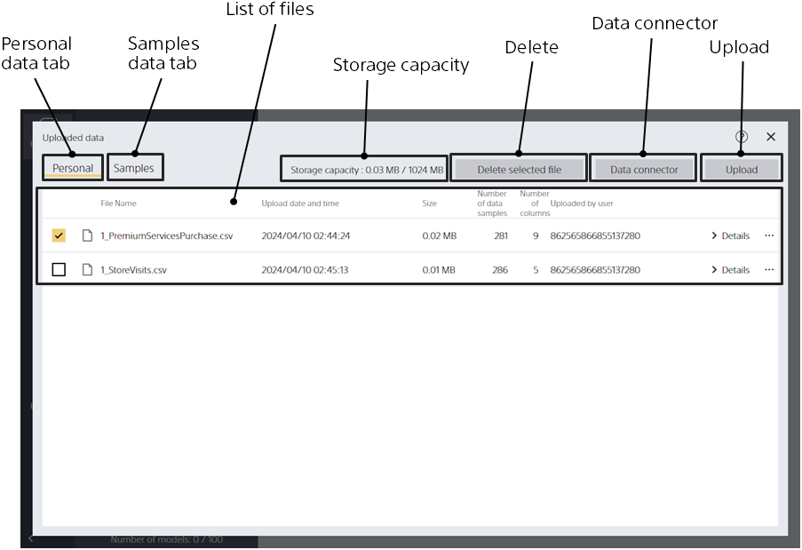

Clicking the "Data" button takes you to this screen.

{}

You can check the attribute information of each uploaded file in the "File List".

- Filename: File name of the data.
- Date and Time: The date and time the file was uploaded.
- Size: The size of the file. There is an upper limit on the total size of files that can be uploaded.
- Rows: The number of rows of data.
- Columns: The number of columns (variables) in the data.
- Uploaded by: The user who uploaded the file. If there is a nickname setting, the nickname is displayed. If there is no setting, the account ID is displayed.
{}

{}
{}
{}
{}

{}

There is a fixed limit to the total amount of data that can be uploaded. You can check the limit and the current amount used by looking at "Storage capacity". Files cannot be uploaded if they exceed the limit. The upper limit is decided for each plan. Personal and shared capacity counts separately.

{}

The following three data list screens can be switched by the tabs.

- Personal: This screen lists personal data. Data that only you can access.
- Shared: A screen that lists data for sharing. Data that can be shared between accounts belonging to the same tenant (group). The free trial version doesn't offer data sharing, so you won't see a sharing tab.
- Sample: Sample data for use in the tutorial.
{}

{}
{}
{}
You can also specify a file from the "Select Local File" button.
You can upload files in either the csv (comma-delimited) or tsv (tab-delimited) format.
{}

{}
{}
You can select multiple files.
{}
{}
{}
Alternatively, you can select "Delete" from the three-point reader at the right end of each file line in the "File List".
{}
{}

{}
{}
{}
{}
{}
{}
{}
{}
You can transfer files in either the csv (comma-delimited) or tsv (tab-delimited) format.
{}
{}

{}
{}
You cannot upload files directly to Shared. Please copy the Personal upload for Shared.
{}
{}

{}
{}
{}
{}

{}
{}
{}
{}

{}
{}
{}
{}