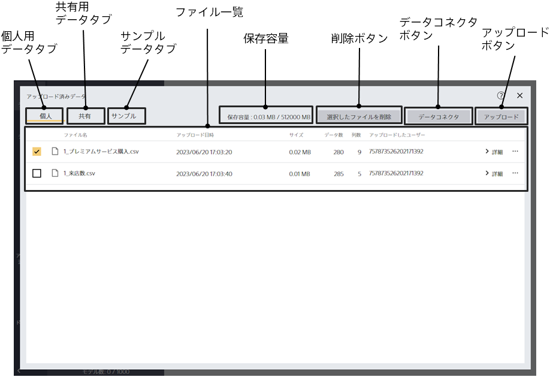

「アップロード済みデータ一覧画面」ボタンをクリックすると、この画面に遷移します。

{}

「ファイル一覧」でアップロードした各ファイルの属性情報が確認できます。

- ファイル名：データのファイル名です。
- アップロード日時：ファイルをアップロードした日時です。
- サイズ：ファイルのサイズです。アップロードできるファイルの合計サイズには上限があります。
- データ数：データの行数です。
- 列数：データの項目数です。
- アップロードしたユーザ：ファイルをアップロードしたユーザです。ニックネームの設定があればニックネームが、設定がなければアカウント ID が表示されます
{}

{}
{}
{}
{}

{}

データはアップロードできる容量の合計に上限が決まっています。「保存容量」をご覧いただくと上限と、現在の利用容量が確認できます。上限を超える容量になる場合ファイルをアップロードできません。上限はプランごとに決まっています。また、個人用と共有用ではそれぞれ別で容量がカウントされます。

{}

タブによって以下の三種類のデータ一覧画面を切り替えることができます。

- 個人用：個人用のデータが一覧される画面です。自分しかアクセスできないデータです。
- 共有用：共有用のデータが一覧される画面です。同じテナント（グループ）に属するアカウント間で共有できるデータです。無料体験版ではデータ共有の機能は利用できないので、共有用タブは表示されません。
- サンプル：チュートリアルで利用するサンプルデータです。チュートリアルごとに使用するデータがわかるようになっています。
{}

{}
{}
{}
「ローカルのファイルを選択」ボタンからファイルを指定することもできます。
アップロードできるファイルは、csv 形式（カンマ区切り）か tsv 形式（タブ区切り）のいずれかです。
{}

{}
{}
複数のファイルを選択できます。
{}
{}
{}
他の方法として、「ファイル一覧」の各ファイル行の右端の三点リーダーから「削除」を選択しても、ファイルの削除ができます。
{}
{}

{}
{}
{}
{}
{}
{}
{}
{}
転送できるファイルは、csv 形式（カンマ区切り）か tsv 形式（タブ区切り）のいずれかです。
{}
{}

{}
{}
共有用へ直接ファイルをアップロードすることはできません。個人用へアップロードしたものを共有用にコピーしてください。
{}
{}

{}
{}
{}
{}

{}
{}
{}
{}

{}
{}
{}
{}