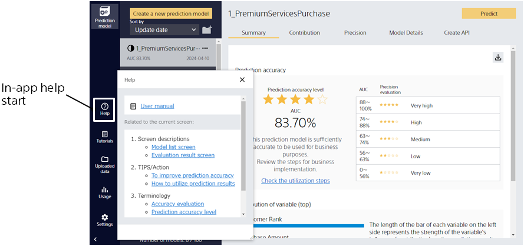
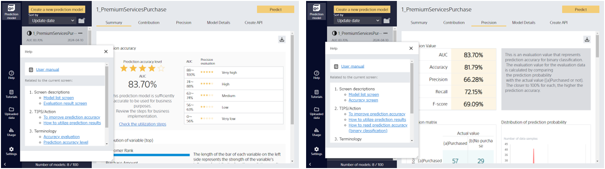

If you would like to check screen explanations, tips, or terminology, you can use the in-app help.

Clicking on the links in the help will open a web page with more information.
The help required for the current screen is displayed on the screen itself, allowing easy access to any areas you do not understand.

The help can be moved to any position by holding down the mouse button.
It can also be closed by pressing the in-app help launch button or the X button in the upper right corner of the help.
To reopen, click the in-app help launch button.

If the help does not resolve the issue, please make an inquiry by clicking the [Contact support] button.
A form will open. Please fill in the required information and submit.
