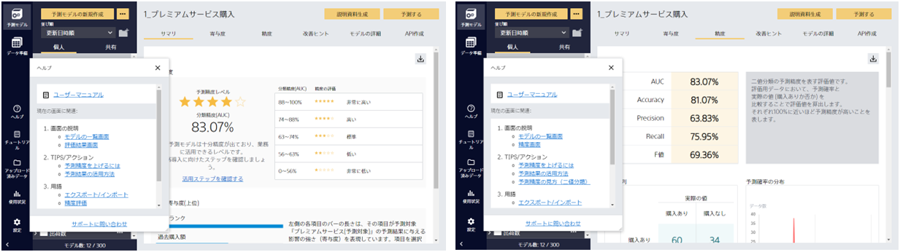

画面の説明やTIPS、用語について確認したい場合は、アプリ内ヘルプで確認できます。

ヘルプ内のリンクをクリックすると、詳細が記載されたWebページが開きます。
現在表示されている画面に必要なヘルプが表示されるので、わからない部分に簡単にアクセスできます。

一度起動したヘルプは次回アプリ起動時も表示されたままになるので便利です。

ヘルプは、マウスでクリックしたまま任意の位置に移動できます。 
また、アプリ内ヘルプ起動ボタンもしくはヘルプ内右上の×ボタンで閉じることができます。 
再度開く時は、アプリ内ヘルプ起動ボタンをクリックしてください。

ヘルプで解決しない場合は、【サポートに問い合わせ】ボタンからお問い合わせください。
送信フォームが開きますので、必要事項を入力の上ご送信ください。
