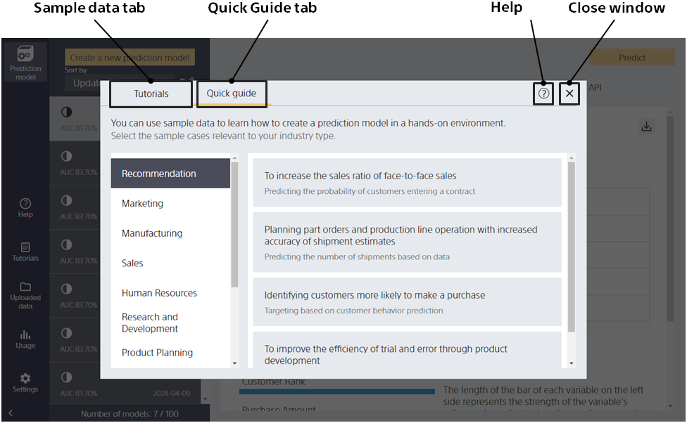
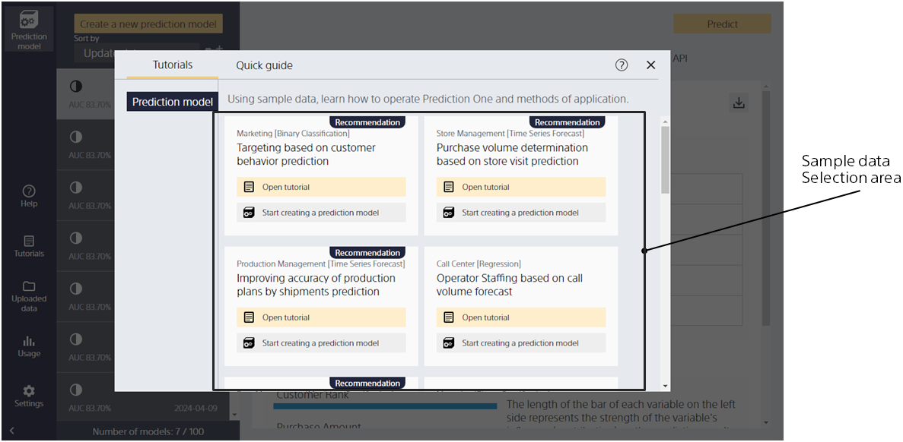

Clicking the [Document] button at the top of Prediction One will take you to this screen.
In the document screen, you can run the Quick Guide, select the sample data and open the manual.

{}
{}
{}
{}

{}
{}
{}

{}
{}
{}
Select Tips to open a Tips document (HTML page). The Tips pages can also be found in the "Tips" section of this manual.
{}
{}

{}
{}
{}
