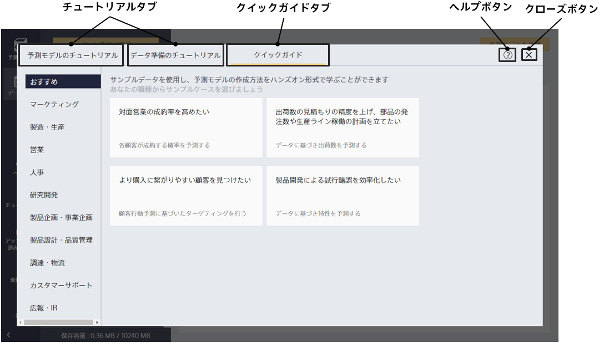

Prediction One の「チュートリアル」ボタンを押すとこの画面に遷移します。
{}
業務タイプや予測タイプ別にカテゴリを選択するとそれぞれに該当するチュートリアルを表示することができます。  
参照したいアイテムを選択することで、そのチュートリアルの説明ページと、予測モデル作成に使用するサンプルデータが保存されたフォルダーが開きまます。  
{}
{}
チュートリアルの参照や、サンプルデータを使用しての予測モデル作成開始、クイックガイド実施などの操作を行うことができます。​  
{}

{}
{}

- 各サンプルケースのチュートリアルや、サンプルデータを使用した予測モデルの作成へ進むことができます。​  
{}
- 業務タイプや予測タイプ別にカテゴリを選択するとそれぞれに該当するチュートリアルを表示することができます。  
{}
- 「予測モデルの作成を開始」ボタンをクリックすると、予測モデルの新規作成画面に遷移します。​  

{}
{}

{}
{}

- サンプルデータを使用して、予測モデルの作成をハンズオン形式で学ぶことができます。​
- 予測モデルの新規作成のステップを確認したい場合はこちらの利用がおすすめです。​
- クイックガイドの詳細については「{}」を参照してください。​

{}
{}
