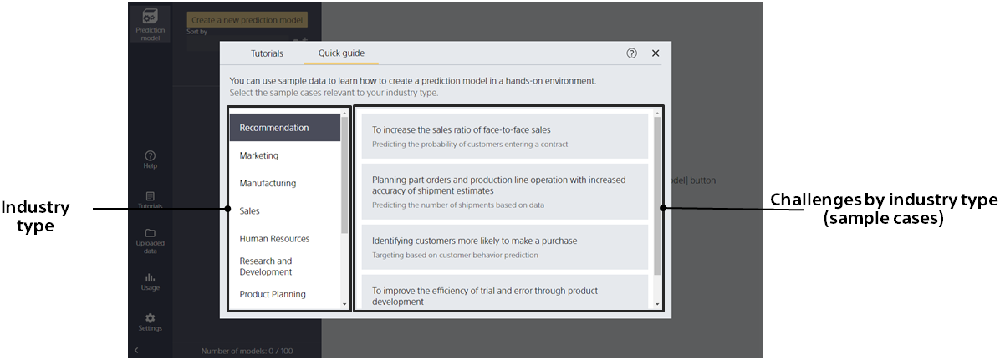
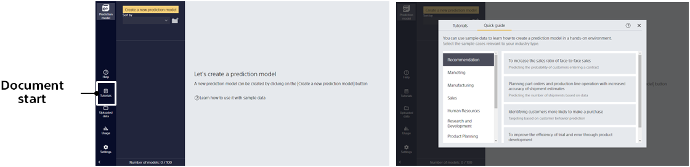

Sample data can be used to see how to create a prediction model.      

By selecting your industry type, you can see relevant sample cases.
Click on the case you would like to see to start the prediction model creation guide. 

Click the "Not now" button to exit the Quick Guide.
The Quick Guide can be run again from within the document screen, which is launched with the Document button.
If you wish to check again or check other sample cases, please do so from here.

