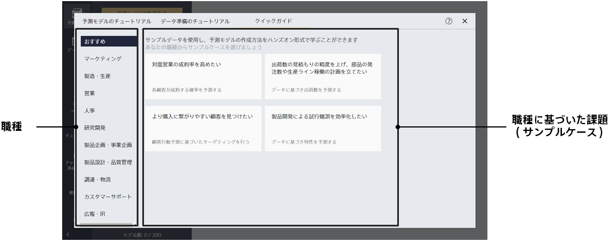
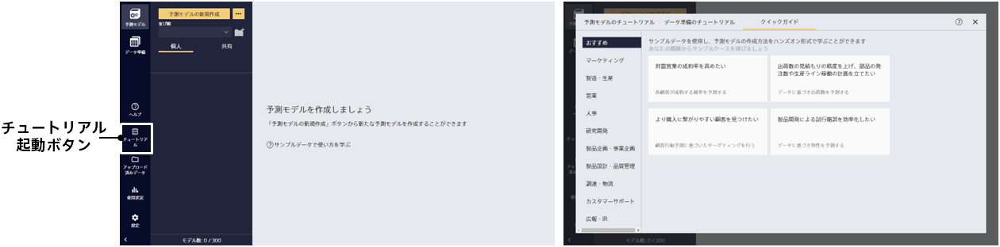

サンプルデータを使用して、予測モデルの作成方法をハンズオン形式で確認することができます。

ご自身の職種を選択すると、それに基づいた課題（サンプルケース）が表示されます。
確認したいケースをクリックすると、予測モデル作成のガイドが始まります。 

「今は確認しない」ボタンをクリックすると、クイックガイドが終了します。
クイックガイドは、「チュートリアル」ボタンで起動するダイアログのクイックガイドタブから再度実施できます。​
もう一度確認したい場合や、他のサンプルケースを確認したい場合などはここから実施してください。

