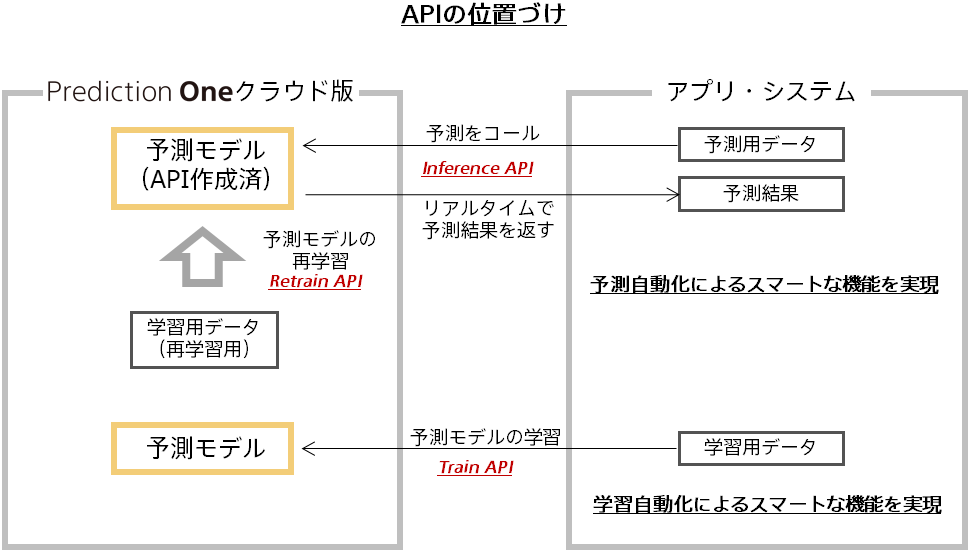

### API List

| No.  |  API Name     | Function Overview              |
| :--- | :--------- | :------------------  |
|1 | Inference  | Perform prediction on prediction data with created model|

For information on the relationship between each API, see the figure below.

