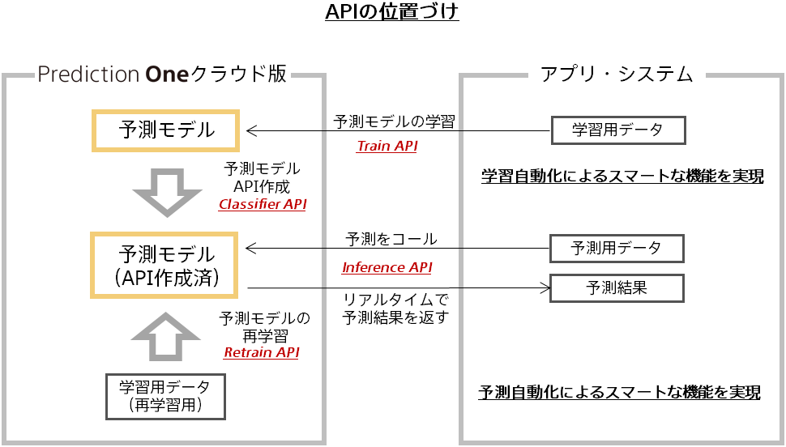

### API一覧

| No.  |  API名     | 機能概要              |
| :--- | :--------- | :------------------  |
|1 | Inference  | 予測データに対して作成済モデルによる予測を実行する|
|2 | Create Classifier  | 予測APIを作成する|
|3 | Get Classifier  | 予測APIを取得する|
|4 | Update Classifier  | 予測APIを更新する|
|5 | Delete Classifier  | 予測APIを削除する|

各APIの関係性は以下の図をご覧ください。

