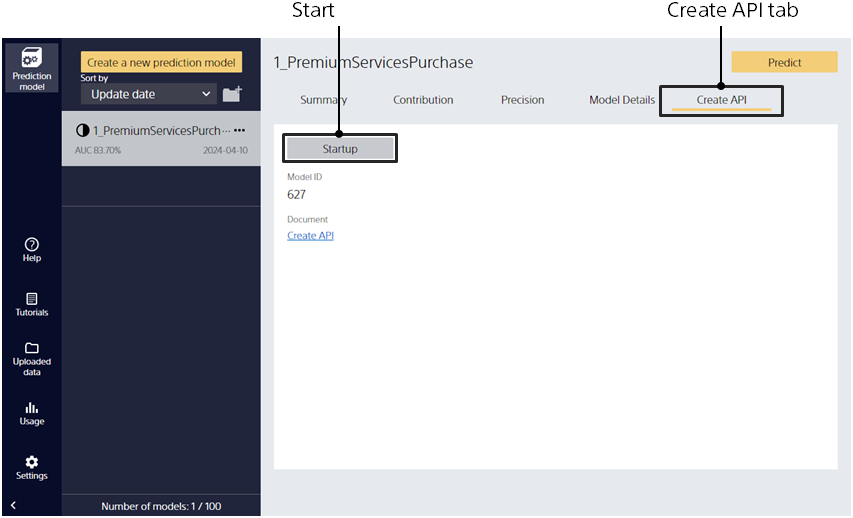
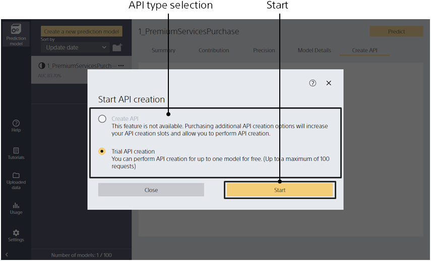
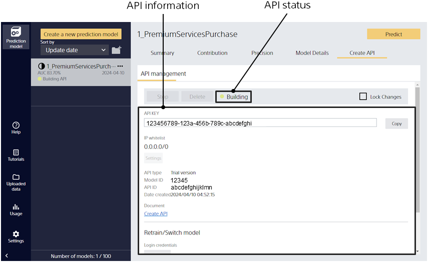

Clicking the [Create API] tab of a created prediction model takes you to this screen.
For the API specifications, refer to "{}."

{}
{}
{}
{}

- Create API: Creates an official API. It can be used by purchasing the API option. You can create one API for each API option you purchase. This type cannot be selected with the trial version.
- Create trial API: Creates a trial API. The created API can be used for up to 100 requests.

{}
{}

The following screen is displayed when the API has been created.

{}
Check [API information].

- API type: Displays whether the API is an official API or trial API.
- Model ID: The ID of the model.
- API ID: The ID of the API.
- API URL: The endpoint URL of the API.
- API Key: The API key.
- IP whitelist: The IP address whitelist. Only the IP addresses registered to the whitelist can use this API. To allow all IP addresses, specify ‘0.0.0.0/0’.
- Date/time created: The date and time that the API was created.
{}

{}
Check [API request count]. The number of requests is counted daily and displayed as a graph.

- Status 200: The number of requests without an error.
- Status 4xx or 5xx: The number of requests with an error. 4xx refer to client errors and 5xx refer to server errors, but the total count is displayed.
{}

{}
Check [API status].

- Building: Building the API.
- Updating: Updating the API.
- Operating: The API is operating. Requests to the API can be processed in this state.
- Stopped: The API is stopped. Requests to the API cannot be processed in this state.
- Deleting: Deleting the API.
{}

{}
{}
{}
{}
To delete an IP address from the IP whitelist, click the [Delete] button on the right of the corresponding IP address.
{}

{}
Click the [Stop] button.
{}

{}
With the prediction API stopped, click the [Delete] button. When you delete an API, the number of API options in use decreases and you can create an API with another model.
{}

{}
Click the [Lock API] button. The API is locked and cannot be stopped. This prevents users from accidentally stopping the API.
{}

{}
 With the prediction API locked, click the [Lock API] button. Only an account with the administrator role can perform this operation.
 The administrator role is configured in the User Portal.
{}

