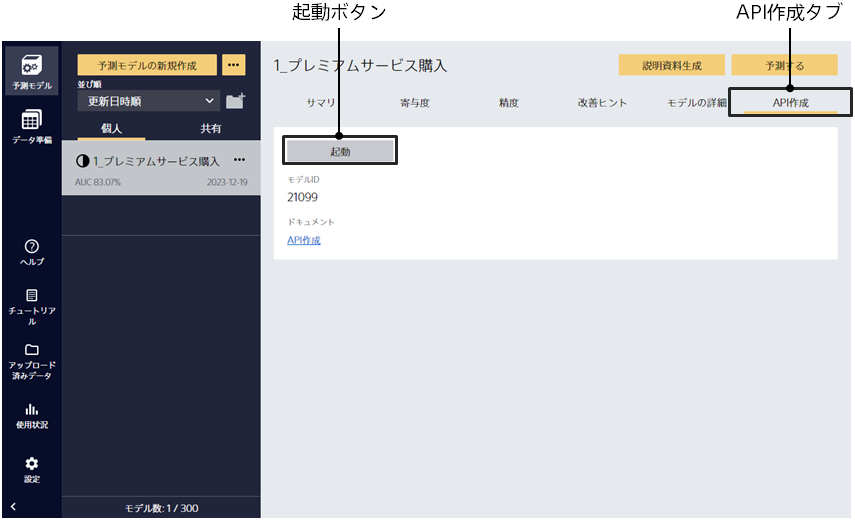

作成済の予測モデルについて「API作成タブ」をクリックすると、この画面に遷移します。
APIの仕様は「{}」をご覧ください。

{}
{}
{}
{}

- API作成：正式版のAPIを作成します。APIオプションを購入すると利用できます。購入したAPIオプションの数だけAPIを作成することができます。体験版では本タイプは選択できません。
- トライアルAPI作成：トライアル用のAPIを作成します。作成したAPIは100リクエストまで利用できます。

{}
{}

APIが作成されると以下の画面が表示されます。

{}
「API情報」を確認します。

- APIタイプ：正式版かトライアル版かが表示されます
- モデルID：モデルのIDです
- API ID：APIのIDです
- API URL：APIのエンドポイントのURLです
- API Key：API Keyです
- IPホワイトリスト：IPアドレスのホワイトリストです。ホワイトリストに登録されたIPアドレスのみからこのAPIを利用できます。全てのIPアドレスを許可する場合は、0.0.0.0/0を指定してください。
- 作成日時：APIを作成した日時です
{}

{}
「APIリクエスト数」を確認します。リクエスト数が日ごとにカウントされ、グラフとして表示されます。

- ステータス200：エラーではなかったリクエスト数です。
- ステータス4xx, 5xx：エラーとなったリクエスト数です。 4XX はクライアントエラー、5XX はサーバーエラーですが、合計数が表示されます。
{}

{}
「APIステータス」を確認します。

- 構築中：APIを構築中です
- 更新中：APIを更新中です
- 動作中：APIが動作中です。APIへのリクエストを処理できる状態です。
- 停止済：APIを停止中です。APIへのリクエストを処理できない状態です。
- 削除中：APIを削除中です。
{}

{}
{}
{}
{}
IPホワイトリストからIPを削除したい場合は、該当のIPアドレスの右の「削除」ボタンをクリックします。
{}

{}
「停止ボタン」をクリックします。
{}

{}
予測APIが停止されている状態で「削除ボタン」をクリックします。APIを削除するとAPIオプションの利用数がひとつ減り、他のモデルでAPI作成ができるようになります。
{}

{}
「APIロックボタン」をクリックします。APIがロックされ停止ができなくなります。誤操作による停止を防止する機能です。
{}

{}
 APIがロックされている状態で「APIロックボタン」をクリックします。管理者ロールのアカウントしか実行できません。
 管理者ロールの設定はユーザポータルで行います。
{}

