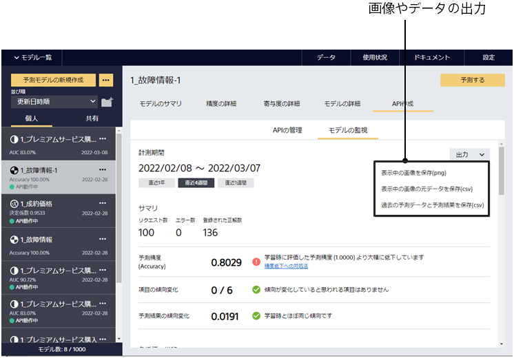
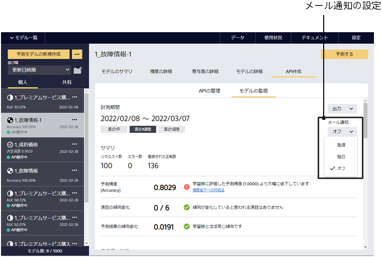

モデルの監視タブに表示されている内容を画像として、あるいは元となるデータをcsv形式として出力することや毎日メールによるレポートを送信することも可能です。

まず下図のように、ページの右上に存在する出力ボタンを用いることで画像や画像の元となるcsvデータを出力することができます。特に過去の予測結果の生データのcsvを出力することで予測APIに入力されている値が想定通りか確かめることができます。

次に、監視結果をメールにより送信する方法を説明します。下図のように メール通知のプルダウンメニューから「毎週」を選択すると週に1回、「毎日」を選択すると1日に1回、ユーザのメールアドレスにサマリに記述された内容がメールで送信されます。その際、 info@predictionone.sony.biz からのメールを受信可能に設定しておくことが必要になります。

