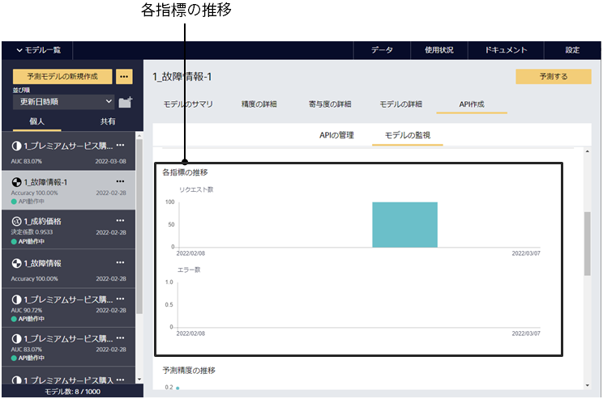
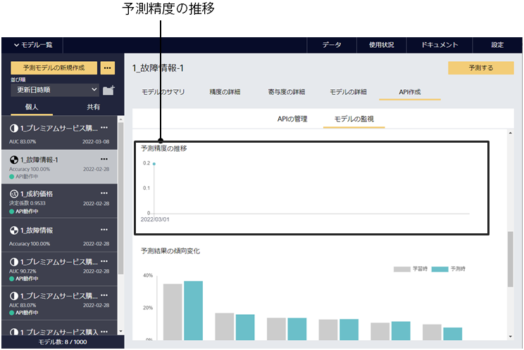
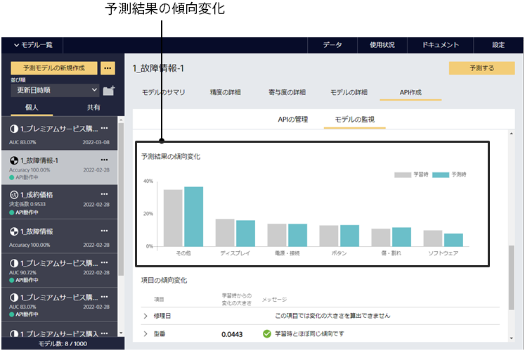
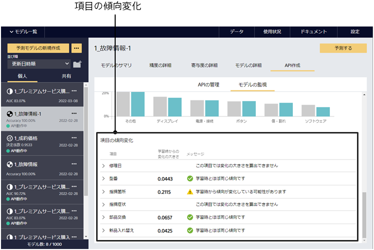

モデルの監視タブには、計測期間とその期間内における APIのリクエスト数とエラー数、予測精度や項目の傾向変化、予測結果の傾向変化といった値が表示されます。これらの値は、予測APIに入力されたデータや出力した値が学習時からどのくらい変化しているかを表しています(監視対象の内容や値の詳細については{}に記載しています)。

画面上部の計測期間を変えることで予測APIの入力と出力のデータに関して短期的な傾向と長期的な傾向をそれぞれ見ることができます。

まず、サマリの欄には計測期間内のリクエスト数とエラー数、登録された正解数に加えて次の3つの値が表示されます。
1. 予測精度：登録した正解をもとに、予測がどれくらい当たっているかを表示します
2. 項目の傾向変化：学習時から傾向が変化している項目がどのくらいあるかを表示します
3. 予測結果の傾向変化：学習時と予測時における予測結果の変化の大きさを表示します

また、これらの項目はそれぞれ青/黄/赤のアイコンがついており、
- 青：学習時からほとんど変化していない値
- 黄：学習時からいくらか変化している値
- 赤：学習時から大幅に変化している値

を表します。黄や赤のアイコンが表示された場合は注意が必要で、予測したデータがどのように変化しているか見てみることを推奨します({})。

次に、各指標の推移および予測精度の推移には、計測期間におけるリクエスト数とエラー数、(正解を登録したデータが存在する場合は)予測精度の推移が表示されます。これは計測期間内でさらに細かくリクエスト数とエラー数、予測精度を見てみるときに有効です。

更にページを下にスクロールすると、予測結果の傾向変化と項目の傾向変化について詳細な内容がグラフとともに記述されています。これらのグラフは学習時と予測時のデータの傾向変化を描画したものとなっており、学習時と予測時でグラフの形がかけ離れているほど学習時と予測時でデータの傾向が違うということになります。

上述のように黄や赤のアイコンが表示されているときはそれらについて注意してみてみることを推奨します。警告として表示されるメッセージの一覧と、それらの問題に関して対応する方法については{}に記載があるのでぜひ参考にしてみてください。

