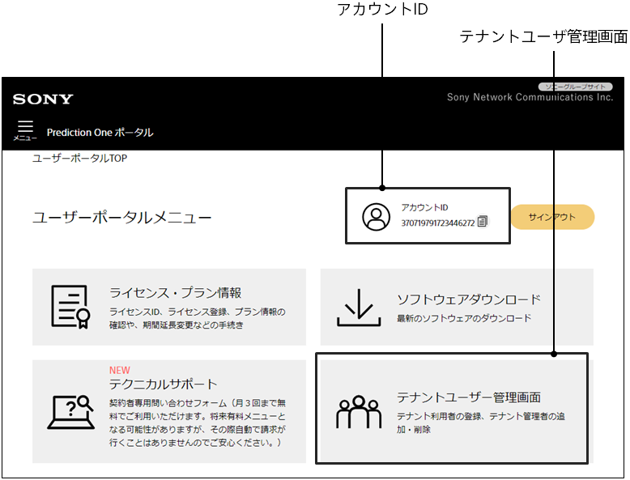
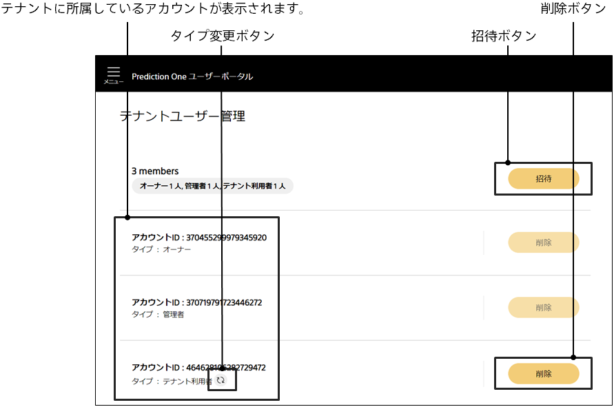
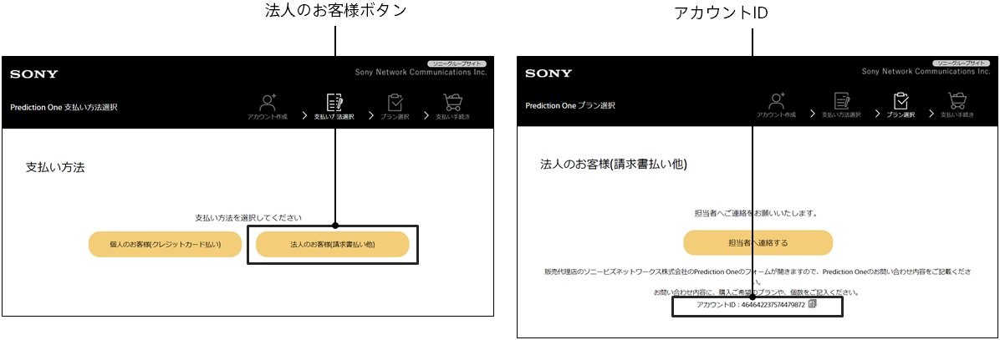

If you have a paid plan with multiple people in the cloud version, you can share models and data with the account by adding an account to the tenant.

The tenant operations are performed in the user portal.

https://predictionone.sony.biz/portal/

{}
The plan administrator (tenant administrator) does the following:
Check the account ID of the account you want to add beforehand. How to verify the account ID is explained at the bottom of this page.
{}
{}
Users of the account participating in the tenant do the following:
{}

{}
{}

{}
{}
{}

### Verifying Your Account ID

You can verify your account ID in two ways:
{}
{}
{}

{}
{}
