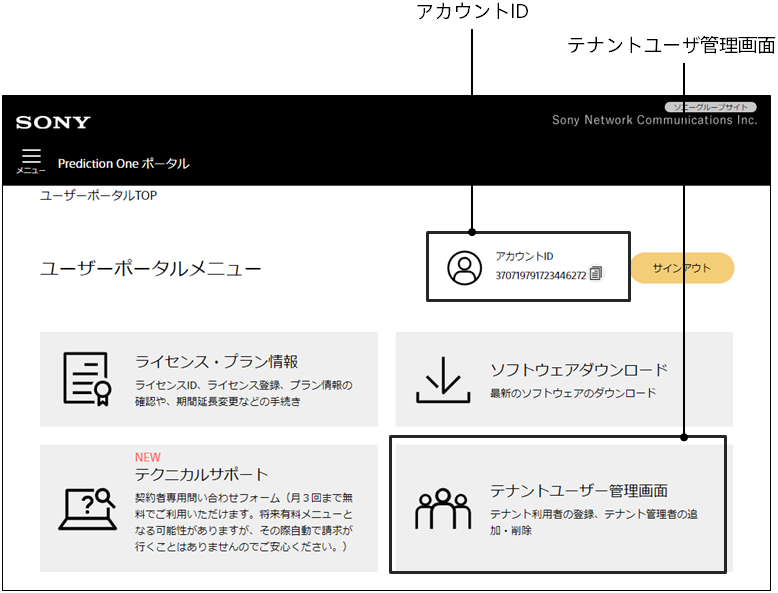
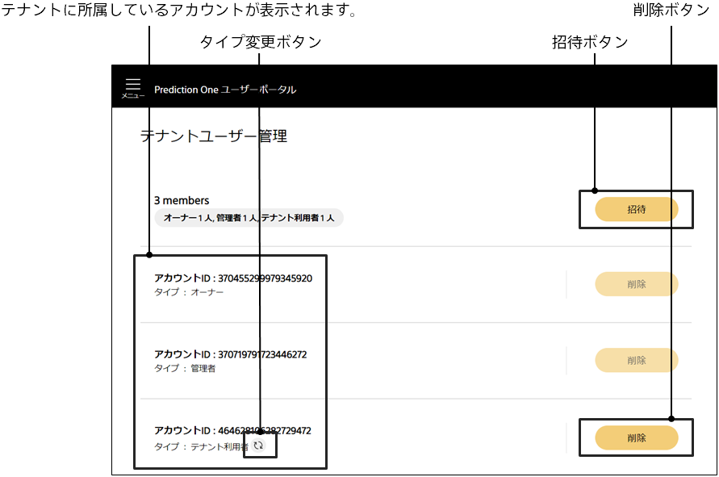
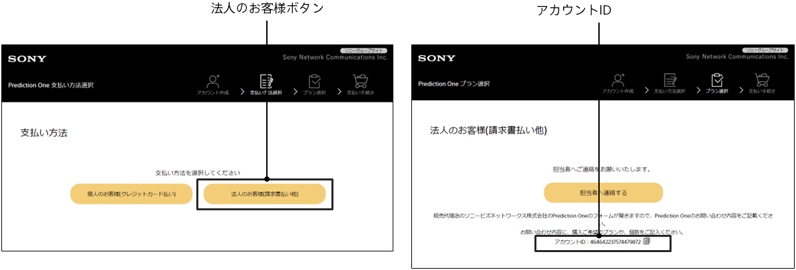

クラウド版で複数人の有料プランをご利用の場合、テナントにアカウントを追加することで、そのアカウントとモデルやデータを共有できるようになります。

テナントに関する操作はユーザポータルで行います。

https://predictionone.sony.biz/portal/

{}
プランの管理者（テナントの管理者）が以下の操作を行います。
あらかじめ追加したいアカウントのアカウント ID を調べておきます。アカウント ID の確認方法は本ページの下の方に説明があります。
{}
{}
テナントに参加するアカウントの利用者が以下の操作を行います。
{}

{}
{}

{}
{}
{}

### アカウント ID の確認

2 つの方法でアカウント ID を確認できます。
{}
{}
{}

{}
{}
