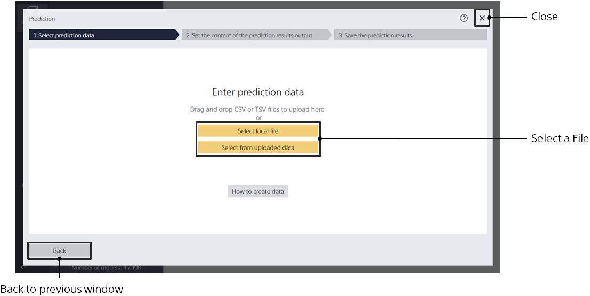
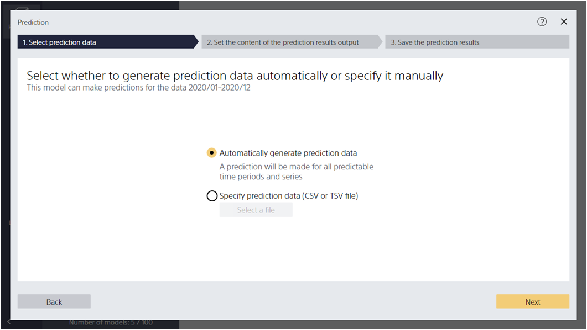
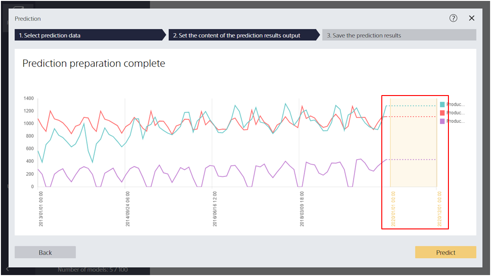

Click the [Predict] button to go to this screen.
On this screen, you can input the data you want to predict to the prediction model.

{}
{}
To make predictions, you need prediction data.
Create prediction data with reference to How to Make Data.

The file formats are CSV (comma separated values) and TSV (tab separated values).
The prediction data items must match the prediction model creation (training) data when the selected prediction model was created,
except for the items that you want to predict.
{}
{}
{}

{}

<u>Only when learning is performed with the time series prediction mode and [Automatic configuration] set</u>,
the prediction data can be automatically created to perform prediction without entering prediction data manually.
For example, you need to prepare prediction data if you used <u>items other than time information items and the items you want to predict such as a record of weather forecasts when creating the prediction model and configured a record of weather forecasts with [Manual configuration]</u>.

{}

{}
{}
{}

{}
{}

{}
{}
{}
