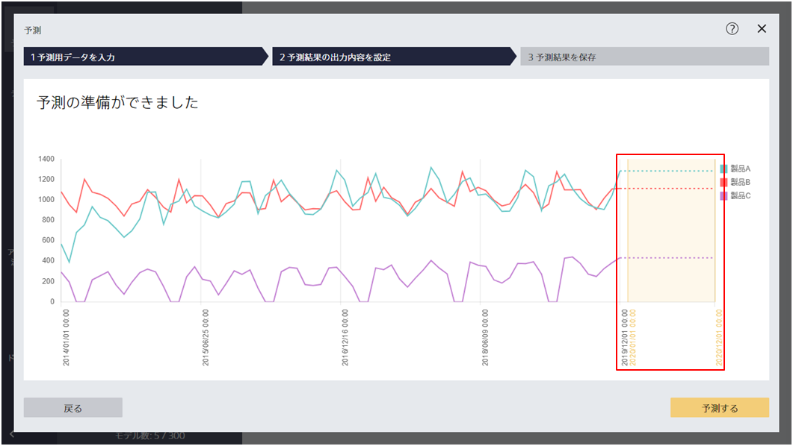

予測するボタンをクリックするとこの画面に遷移します。
この画面では、これから予測を行いたいデータを予測モデルに入力できます。

{}
{}
予測を行うためには、予測用データが必要です。
「データの作り方」を参照にしつつ、予測用データを作成してください。

ファイルフォーマットは CSV (カンマ区切り) と TSV (タブ区切り) に対応しています。
予測用データの項目について、選択している予測モデルを作成した際の予測モデル作成(学習)用データと、
予測したい項目を除いて一致している必要があります。
{}
{}
{}

{}

<u>時系列予測モードかつ「自動で設定」で学習した場合のみ</u>、
予測用データを入力せずとも自動的に予測用データを作成して予測を実行できます。
たとえば天気予報の記録など<u>予測したい項目と時間情報項目以外の項目を予測モデル作成に使用し、「個別に設定」で天気予報の記録を設定した場合は、予測用データを用意する必要があります</u>。

{}

{}
{}
{}

{}
{}

{}
{}
{}
