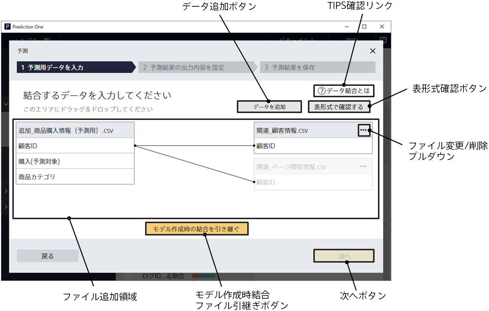

When you create a learning model using the data join feature,
click the [Predict] button to go to this screen.
Use this screen to specify additional related data for the data you want to predict.

{}
{}
To make predictions in a model that uses the data join feature, you must also specify the related data during the prediction.
Refer to What is Data Join? to create prediction data.
The file formats are CSV (comma separated values) and TSV (tab separated values).
The prediction data variables must match the related data when the selected prediction model was created.

{}
{}
{}

{}
You can also use the related data that you used to create the model for the prediction.
{}
The file used during learning is embedded in the related data display.
Of the files that were added when the prediction model was created, only the data of the horizontal join is taken over. Vertical join data is not taken over.

{}
{}

{}
{}
The display changes to the preview screen.
The Next button is not enabled if no related data is specified.
{}
{}

{}
{}
{}

{}
{}
{}
