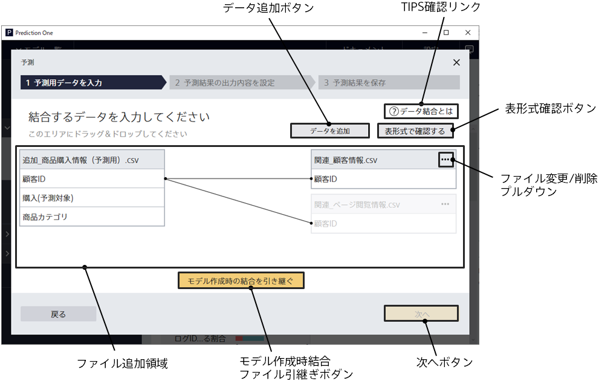

データ結合機能を使用して予測モデルを作成した場合、
予測するボタンをクリックするとこの画面に遷移します。
この画面では、これから予測を行いたいデータに対する関連データを追加指定します。

{}
{}
データ結合機能を使用したモデルで予測を行うためには、予測時にも関連データを指定する必要があります。
「データ結合とは」を参照にしつつ、予測用データを作成してください。
ファイルフォーマットは CSV (カンマ区切り) と TSV (タブ区切り) に対応しています。
予測用データの項目について、選択している予測モデルを作成した際の関連データと一致している必要があります。

{}
{}
{}

{}
予測にモデル作成時に使用した関連データを使用することも可能です。
{}
関連データ表示部に学習時に使用したファイルが埋め込まれます。
なお、予測モデル作成時に追加したファイルのうち、横結合のデータのみ引き継がれます。縦結合のデータは引き継がれません。

{}
{}

{}
{}
予測用データプレビュー画面へ遷移します。
関連データを指定していない場合は「次へボタン」は有効化されません。
{}
{}

{}
{}
{}

{}
{}
{}
