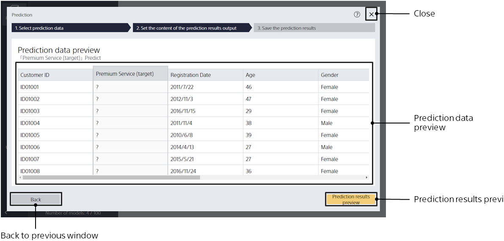
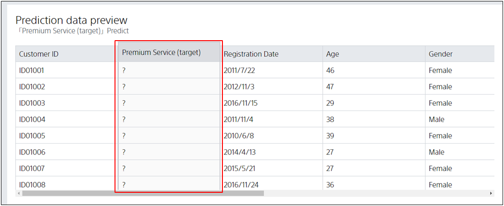

This screen appears when prediction data is specified.

{}
{}
As the prediction data is entered, the preview shows what the variables are predicted from now on.
The following figure shows an example of how "Premium Service" is predicted from variables such as "Past Purchases" and "Coupon Usage Count".

Make sure that the prediction data you entered and the variable you want to predict are correct, and then click Preview.
<u>For prediction models that use the data join feature, values may not be displayed if the preview values take a long time to calculate.</u>

{}
{}
{}

{}
{}
{}

{}
{}
{}
