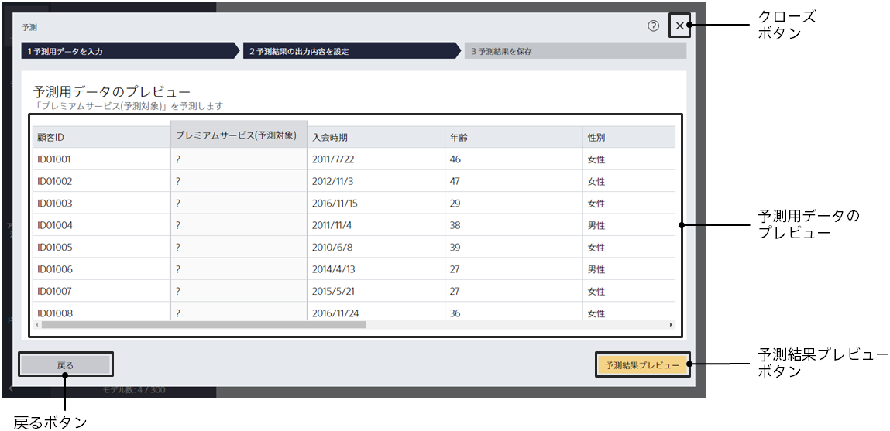
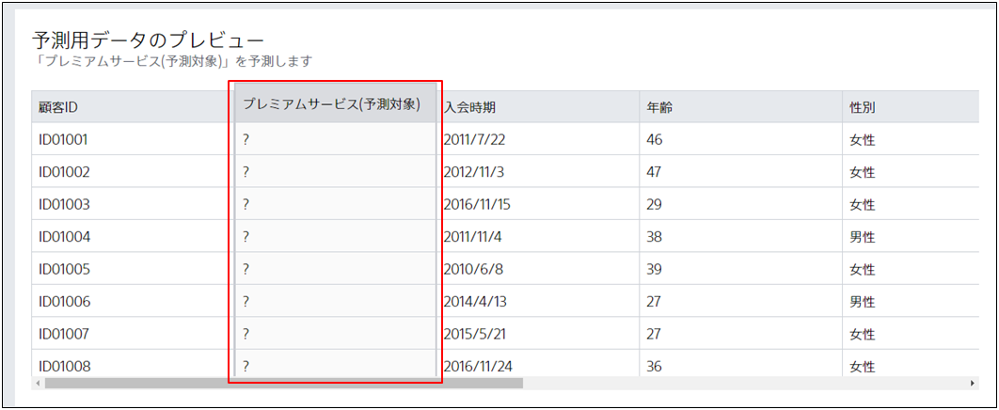

予測用データが指定されるとこの画面に遷移します。

{}
{}
予測用データが入力されると、今から何の項目を予測するかをプレビューに表示します。
以下の図は「過去購入額」「クーポン利用回数」などの項目から「プレミアムサービス」を予測する際の表示例です。

入力した予測用データと予測したい項目が正しいことを確認し、プレビューをクリックしてください。
<u>データ結合機能を使用した予測モデルの場合、プレビュー値の計算に時間がかかる場合には値が表示されない場合があります。</u>

{}
{}
{}

{}
{}
{}

{}
{}
{}
