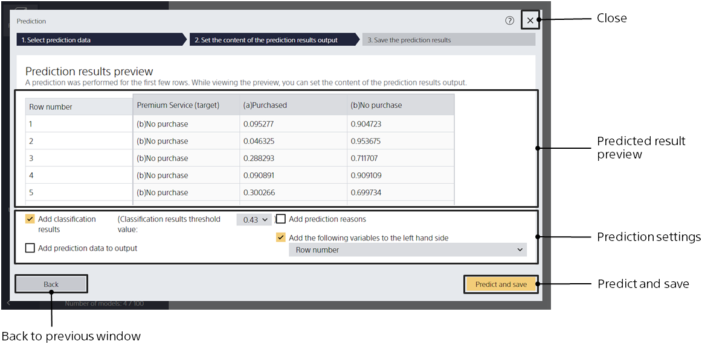
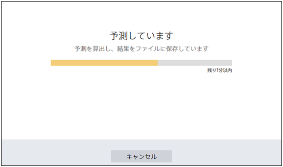
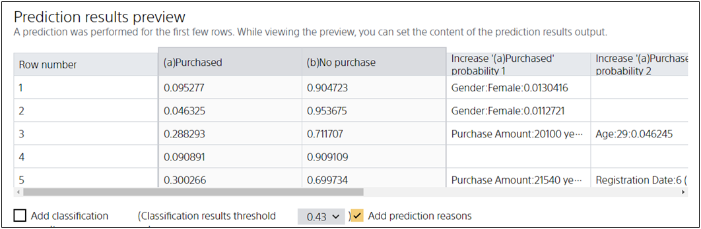
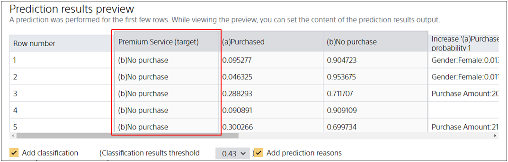

{}
{}
{}
{}
After the file is specified, the prediction is performed on all data contained in the prediction data.
Prediction reasons are also calculated after you click the [Predict and Save] button.

If your prediction data contains a lot of data, this process can take a long time.
In this case, the time remaining to complete the prediction is displayed.

Please wait while the prediction completes without closing the prediction window.

{}
{}

{}
{}
When predicting a classification, the prediction model outputs a probability of the prediction value for each prediction value.

If [Add classification results] is checked, the predicted value with the highest probability is selected by comparing the output probabilities, and the predicted value is added to the prediction results.

For example, in the above figure, the result of comparing the probability of "Purchased" and "No purchase" (in the red frame) is added to the prediction result.
{}
{}
{}

{}
{}
{}
{}

{}
{}
{}
{}

{}
{}
{}
{}
