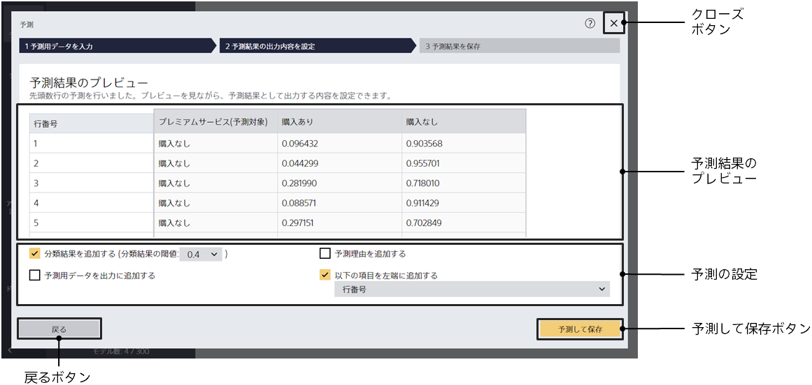
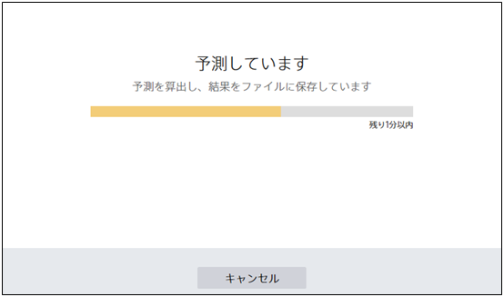
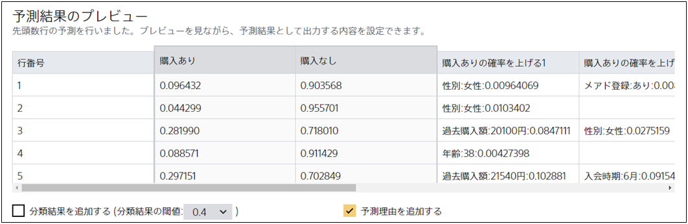
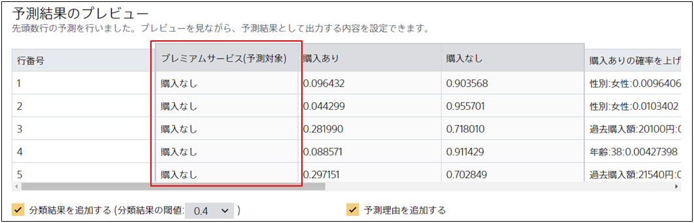

{}
{}
{}
{}
ファイルが指定された後、予測用データに含まれるすべてのデータに対して予測を行います。
予測理由も「予測して保存」ボタンをクリックした後で算出されます。

予測用データに多くのデータが含まれる場合、この処理に時間がかかる場合があります。
その場合、予測が完了するまでの残り時間が表示されます。

予測ウィンドウを閉じずに、予測が完了するまでしばらくお待ちください。

{}
{}

{}
{}
分類の予測を行う時に予測モデルは予測の際に予測値ごとに「どれくらいの確率でその予測値になるか」の確率を出力します。

「分類結果を表示する」にチェックがある場合、出力された確率を比較してもっとも高い確率の予測値を一つ選択し、予測結果にその予測値を追加します。

たとえば上の図の場合、「購入あり」「購入なし」の確率を比較した結果（赤枠箇所）を予測結果に追加します。
{}
{}
{}

{}
{}
{}
{}

{}
{}
{}
{}

{}
{}
{}
{}
