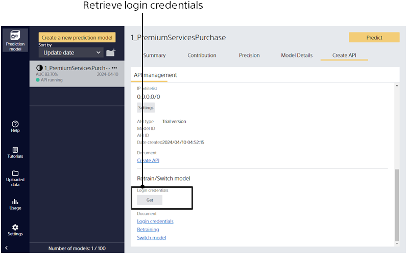

Login credentials are retrieved on the API creation screen.
Clicking the [Create API] tab of a created prediction model takes you to this screen.

Login credentials are valid for 30 days. Retrieve them again after they expire.
Login credentials will be valid for a longer time in a future release.

{}
{}
{}
{}

