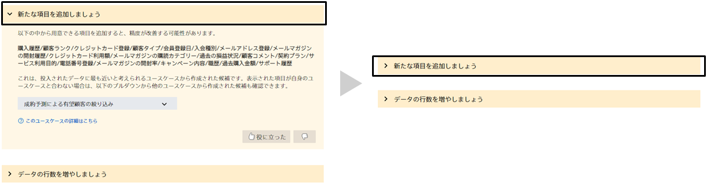
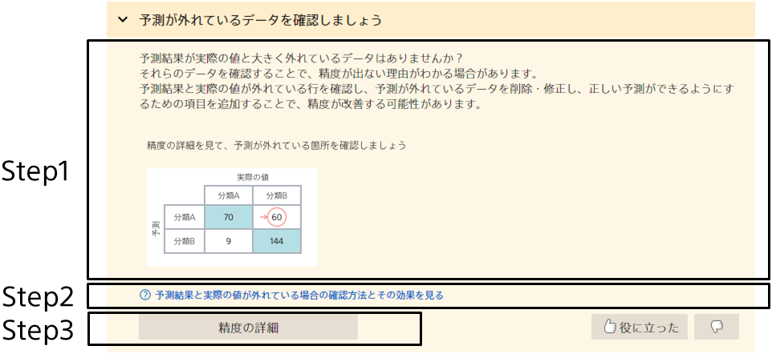
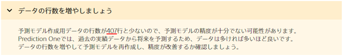
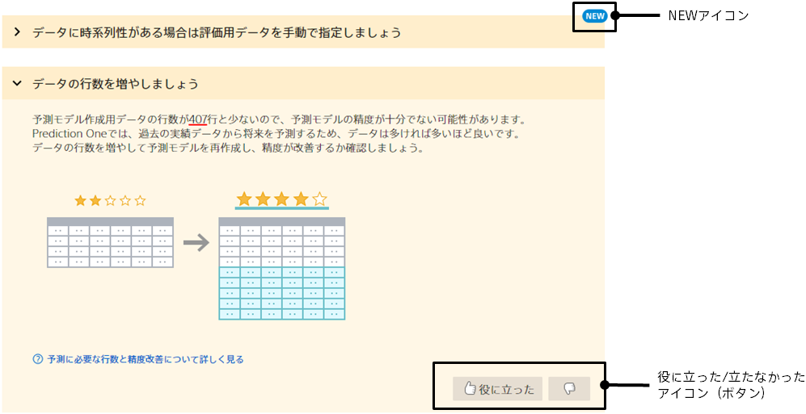

ヒントタブをクリックすると、この画面に遷移します。

精度を改善するためにするべきこと、また精度を改善するためのTipsを確認することができます。

これらのヒントは、学習された予測モデルに基づいて表示されています。
改善を繰り返すことで、表示されるヒントが変わります。

表示されるヒントの一覧は、 TIPS「{}」を参照してください。

{}
タイトルを押すと、ヒント内容の表示・非表示ができます。  

{}

{}
ヒントに表示される3つの情報を活用しましょう。

{}
これらのヒントは、学習された予測モデルに基づき表示されています。
ヒントによっては、予測モデルに関する実際の値や内容が記載されています。

上記のように、実際の値や内容が赤線で表示されます
{}

{}
このヒントに基づいた詳細な手順や内容を理解するために、Webぺージへのリンクが記載されている場合があります。
不安になった場合はWebページを見ながら画面を操作することができます。
{}

{}
ヒントによっては、改善を行う場合に見るべき画面へ遷移するボタンが表示されている場合があります。
ボタンを押して画面遷移した後は、Step2で表示したWebページを参照しながら精度改善のためのアクションをすることができます。
{}
{}

{}

NEWアイコン
- 見たことがないヒントには、このアイコンが表示されます
- タイトルを押してヒント内容を確認すると、アイコンが消えます

役に立った・立たなかったアイコン（ボタン）
- ヒント内容についてモデル改善活動の役に立ったか、立たなかったかをアイコンを押すことでフィードバックできます
{}
