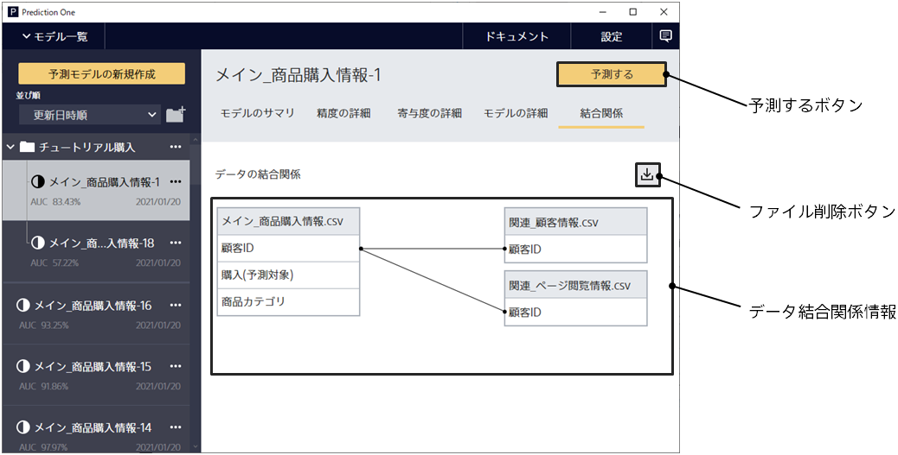

When you create a learning model using the data join feature, the [Join Relation] tab appears.
Click the Join Relation tab to go to this screen.

{}
{}
The same relation diagram that was displayed in the data join screen that was set up during learning is displayed.
{}
{}

{}
{}
{}
{}
