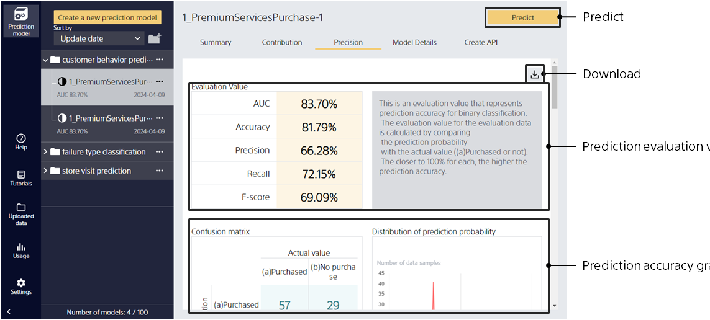
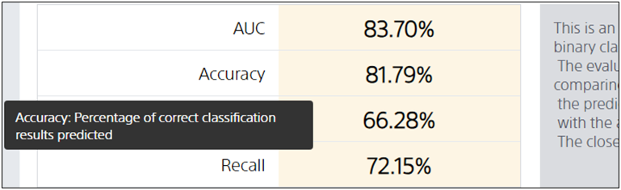
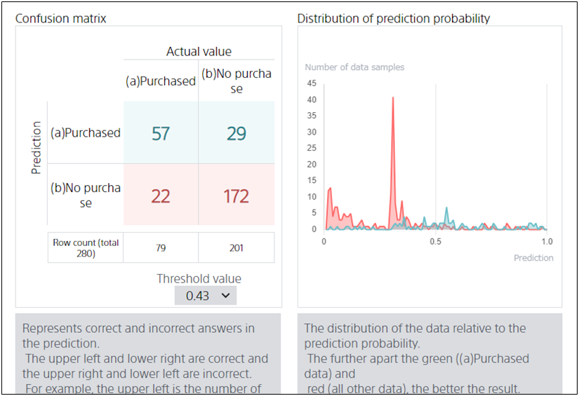
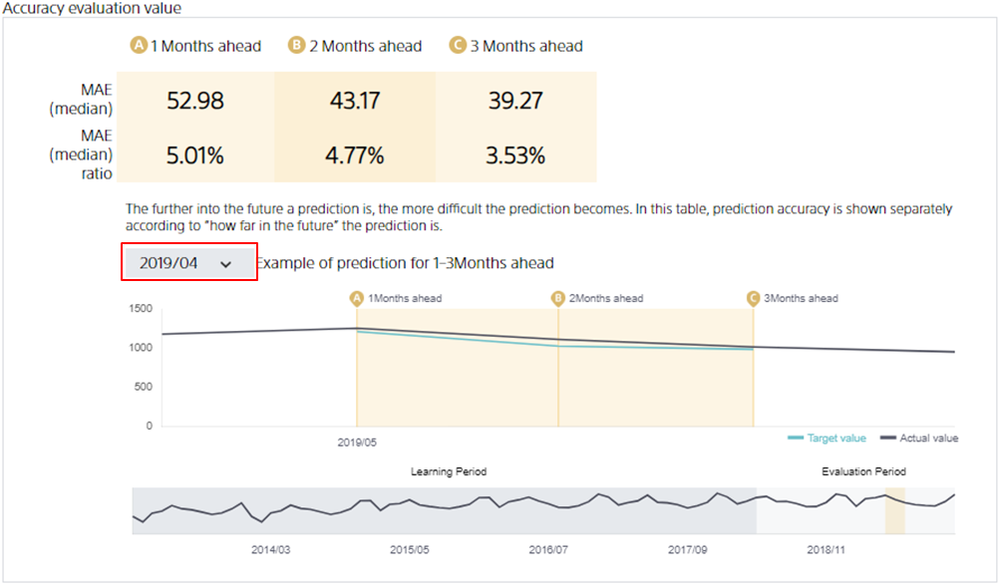
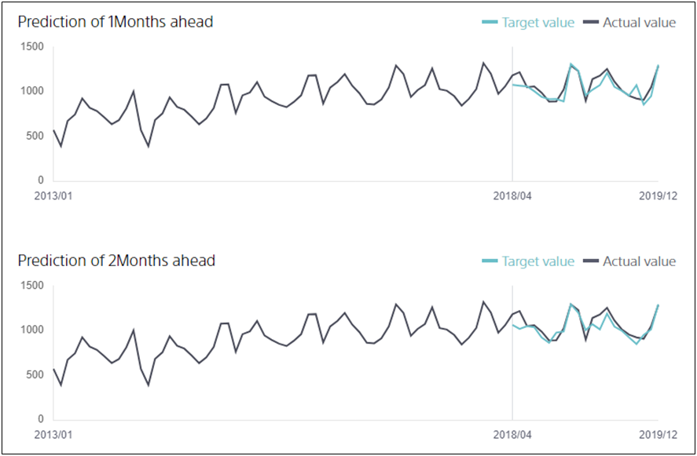
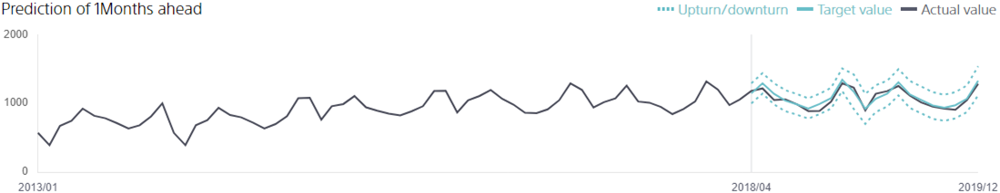
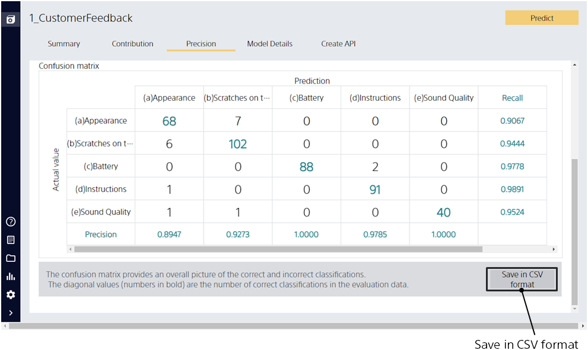

Click the Accuracy Details tab to go to this screen.

{}
{}

Displays a description of each evaluation value.
{}
{}

{}
{}

The type of graph displayed depends on the prediction type.
For example, for binary classification, a graph of a confusion matrix or distribution of predicted probabilities is displayed.

The type of graph displayed depends on the prediction type. See also Tips on how to check prediction accuracy.
{}

- {}
- {}
- {}
- {}
  {}
  {}
  {}

{}
{}

If you are using the time series mode, a graph is displayed that compares the actual and predicted values for the future predicted values from a point in time.
For example, the figure above compares the actual values and predicted values for a 1 to 3 month prediction from 2019/04 (April 2019).

The "Predicted and Actual Values" graph shows how stable the future prediction is.
For example, the figure above compares what the prediction would look like if one month ahead and two months ahead were repeated.

For information on viewing each graph, see the "{}" page in the tips.

{}

When upturn/downturn prediction is enabled, upturn/downturn prediction values are also rendered in the graph, in addition to the comparison of predictions and results.
{}

{}
{}

{}
{}
{}
{}

{}
{}

{}
{}
{}
{}
