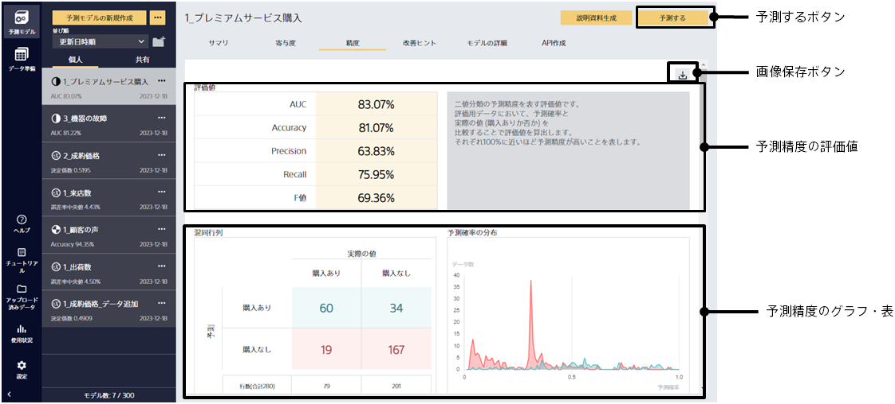
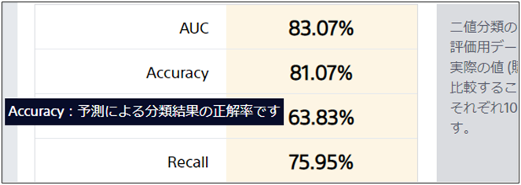
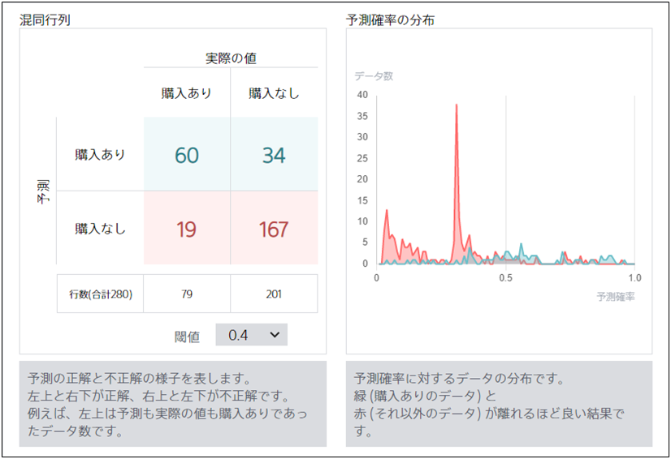
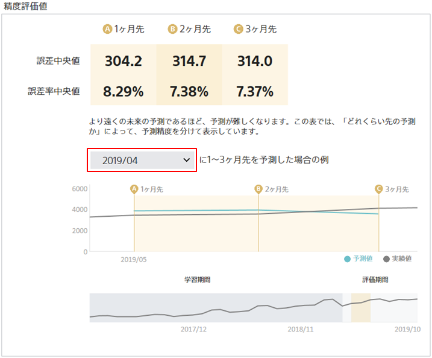
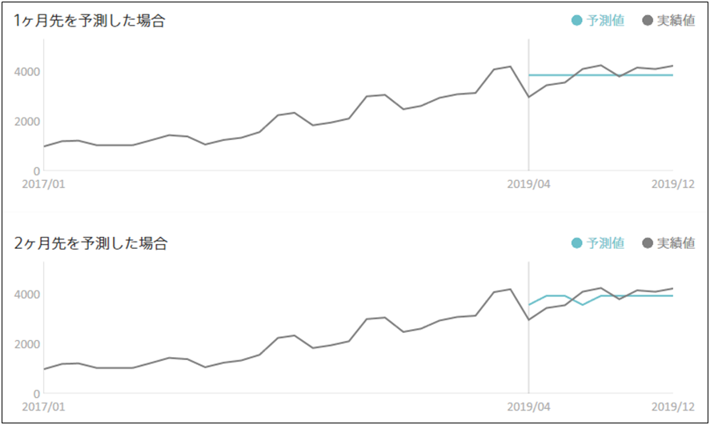
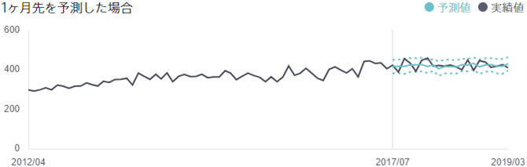
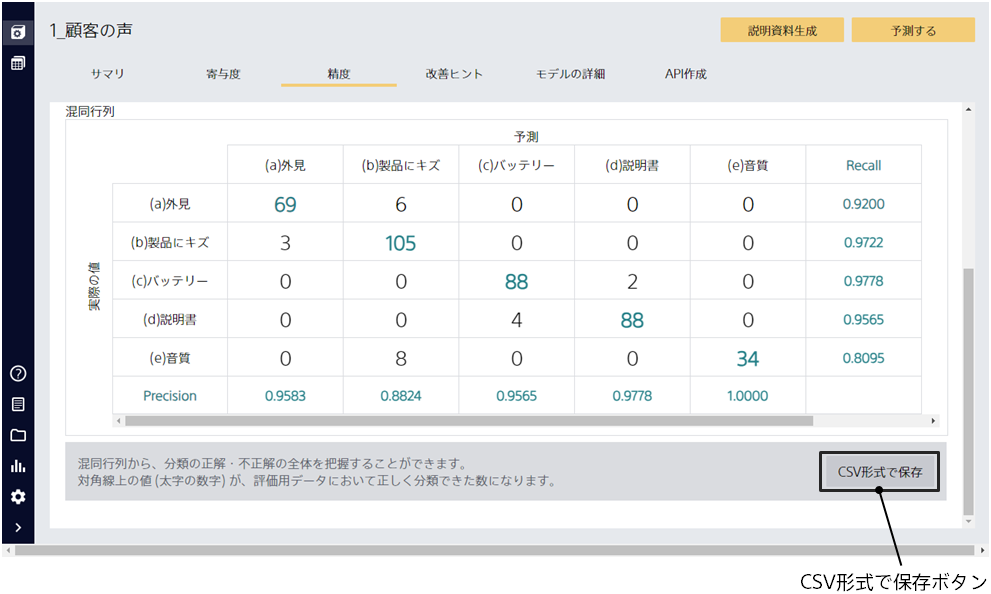

精度タブをクリックするとこの画面に遷移します。

{}
{}

各評価値についての説明が表示されます。
{}
{}

{}
{}

表示されるグラフの種類は予測タイプによって異なります。
たとえば二値分類の場合、混同行列や予測確率の分布のグラフが表示されます。

表示されるグラフの種類は予測タイプによって異なります。予測精度の概要に関する TIPS も参照してください。
{}

- {}
- {}
- {}
- {}
  {}
  {}
  {}

{}
{}

時系列モードを使用している場合、ある時点から実際に未来を予測してみた場合の予測と実績を比較したグラフが表示されます。
たとえば、上の図では「2019/04（2019 年 4 月）」から 1~3 か月先予測を行った場合の予測値と実績値を比較しています。

「予測と実績」グラフでは、将来の予測がどれくらい安定して行えるかを確認できます。
たとえば、上の図では 1 カ月先予測・2 カ月先予測を繰り返し行った場合ではどの様な予測になるかを比較しています。

各グラフの見方については TIPS の「{}」のページを参照してください。

上振れ下振れ予測を有効にした場合には予測と実績の比較だけではなく、上振れ下振れ予測の値もグラフに描画しています。

{}
{}

{}
{}
{}
{}

{}
{}

{}
{}
{}
{}