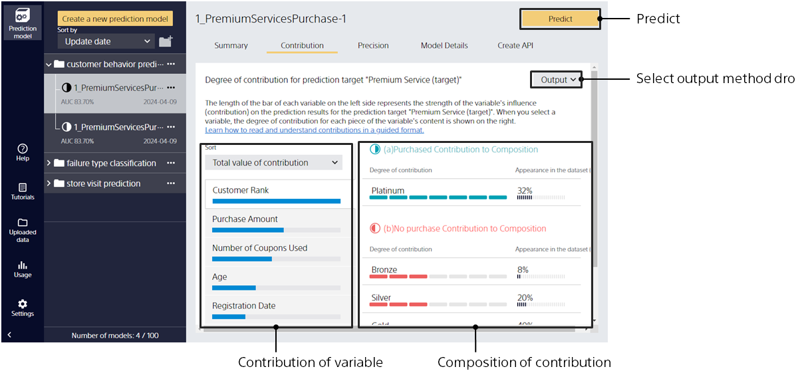

Click the [Understanding] tab to go to this screen.

Displays a summary of how and what inputs the learned prediction model refers to during the prediction.

- Which input variable is strongly related to the variable you want to predict?
- Which value increases or decreases the probability of a strongly related variable?

You can learn such things here.
They can be useful for understanding trends in prediction models and for explaining analysis results to others.
When a prediction model is created using the data join function, the contribution is displayed by the file used during learning.

Clicking on the item name on the left side will switch the content on the right side to the information related to that item.
{}
For each input variable, it indicates how important the prediction model is and whether it contributes to the prediction.
The longer the bar graph, the greater the importance and contribution.
The most important and effective variables have a significant impact on the prediction results.
{}

{}
Shows, up to the top three, how much the value of the variable contributes to which variable you want to predict.
In the contribution of the variable, you can switch the target variable by selecting the variable name.

- Variable content: Equivalent to the value of the variable. Displays the string of a string variable, the numeric range (in the format "[Low] - [High]") of a numeric variable, or the year, month, or day of a Date/Time variable. If a string type variable is treated as a text type, the word archetype is displayed.
- Contribution (binary classification): Indicates the degree to which the two values of the variable to be predicted contribute to the increase in prediction probability.
- Contribution (multiclass classification): The degree to which the value of the variable to be predicted (3 to {} types) contributes to the increase in the prediction probability.
- Contribution (regression): For the target value, the degree of contribution to increase and decrease.
- Contribution (time series prediction): For target value, the degree of contribution to increase and decrease.
- Percentage of occurrence in data : This item represents the percentage of occurrence in the data. 

Refer to Tips "{}".
{}

{}
{}
{}
You can select whether to save an image or output a CSV file. After selecting the output format, specify the destination folder and file name. The displayed content is saved in the selected format. 
For details on the content of the CSV file, see "{}".
{}
{}
