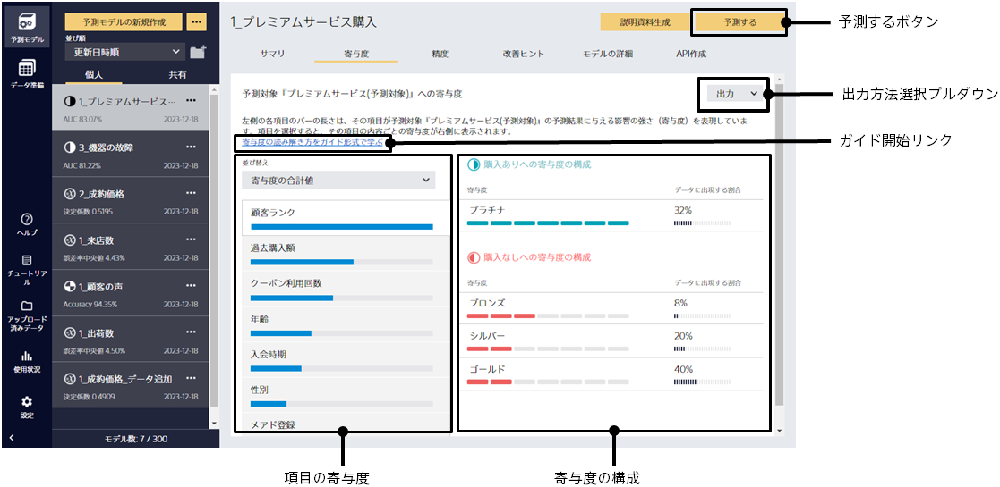

寄与度タブをクリックするとこの画面に遷移します。

学習した予測モデルが、予測の際にどの入力項目をどの程度どのように参照しているかのサマリを表示します。

- 予測したい項目の項目にはどの入力項目の関連が強いのか
- 関連が強い項目について、どの値が予測確率を上げるのか下げるのか

といったことを知ることができます。
これらは予測モデルの傾向を理解することにも有効ですし、他者に分析結果を説明する際にも利用できます。
データ結合機能を用いて予測モデルを作成した場合、寄与度は学習時に用いたファイル別に表示されます。

左側の項目名をクリックすると、右側がその項目に関する内容に切り替わります。

{}
各入力項目について、予測モデルがどの程度重要視しているか・予測に寄与するかを表しています。
棒グラフが長いほど重要度・寄与度が高いことを表します。
重要度・有効度の高い項目が予測結果に大きな影響を与えています。
{}

{}
項目の値が、予測したい項目のどちらにどの程度寄与しているかを、上位 3 つまで表示しています。
項目の寄与度において、項目名を選択することで、対象項目を切り替えることができます。

- 項目内容： 項目の値に相当します。文字列型の項目であれば文字列が、数値型の項目であれば数値範囲 (”[下限値]～[上限値]”の形式) が、日時型であれば、年/月/日のいずれかが、表示されます。文字列型の項目がテキスト型として処理された場合は、単語の原型が表示されます。
- 寄与度 (二値分類) ： 予測したい項目の 2 種類の値について、予測確率増加に寄与する度合を表しています。
- 寄与度 (多値分類) ： 予測したい項目の値(3 ～{}種類)について、予測確率増加に寄与する度合を表しています。
- 寄与度 (数値予測) ： 予測値について、増加および減少に寄与する度合いを表しています。
- 寄与度 (時系列予測) ： 予測値について、増加および減少に寄与する度合いを表しています。
- データに出現する割合：この値がデータに出現する割合を表します。この値を持つデータ数の、評価に使用したデータ数に占める割合です。

寄与度の見方については TIPS「{}」を参照してください。
{}

{}
{}
「寄与度の読み解き方をガイド形式で学ぶ」をクリックすると、寄与度画面の見方や寄与度の読み解き方をガイド形式で確認できます。​
作成された予測モデルについての解説が表示されるので、寄与度の理解についてどこをポイントにして考えれば良いかのヒントを知ることができます。​​
{}
{}

{}
{}
{}
画像で保存とcsvファイルで保存が選べます。選択したら、保存するフォルダーと名前を指定してください。表示内容が選択した形式で保存されます。 
csvファイルの内容の詳細については{}をご確認ください。
{}
{}
