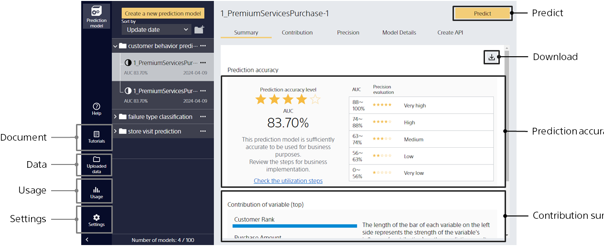
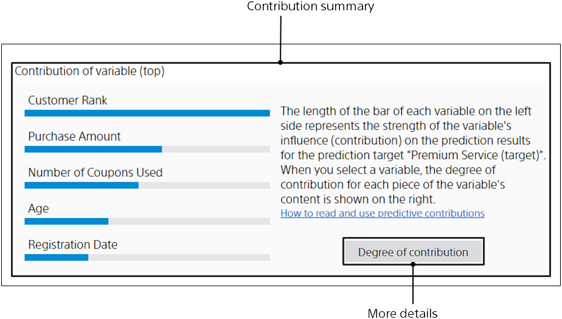

This screen allows you to check evaluation results, such as the prediction accuracy of the learned prediction models.
The evaluation performs a prediction on the learned prediction model for data not used for learning.
Evaluates prediction accuracy by comparing predicted results with correct answers.
For each prediction type (Binary classification, multiclass classification, and regression), information is displayed.
You can toggle the display by clicking Model Summary, Accuracy Details, Contribution Details, and Model Settings.

{}
{}
Displays the key accuracy metrics for each prediction type, along with the levels of prediction accuracy and their descriptions.
The more stars, the better the prediction accuracy level.
If it is judged that the accuracy is improved by increasing the amount of data, that fact is displayed as text.

If the accuracy is good, a link to the utilization method of this model will be displayed. 
If there are points that need improvement, a button will be displayed to the "Hints" tab where you can check the improvement methods.
{}
{}

{}
{}
For each input variable, it shows how important the learned prediction model is and whether it is effective for prediction.
The longer the bar graph, the greater the importance and effectiveness.
The most important and effective variables have a significant impact on the prediction results.
The two colors indicate the importance and effectiveness of each value in the case of binary classification.
{}
{}

{}
{}
{}
{}

{}
{}

{}
{}
